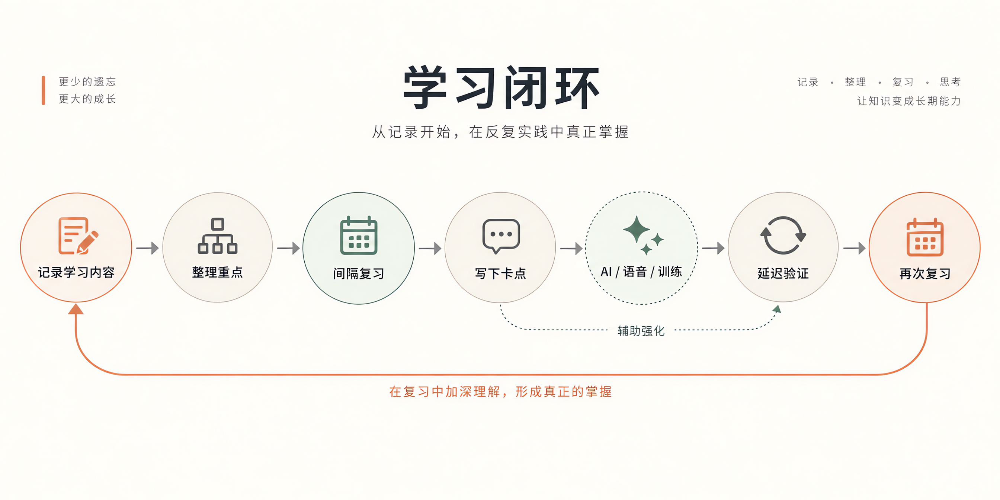
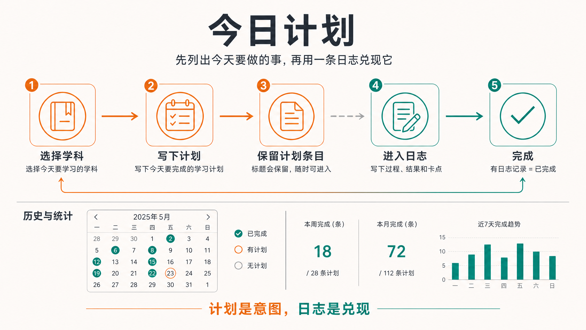
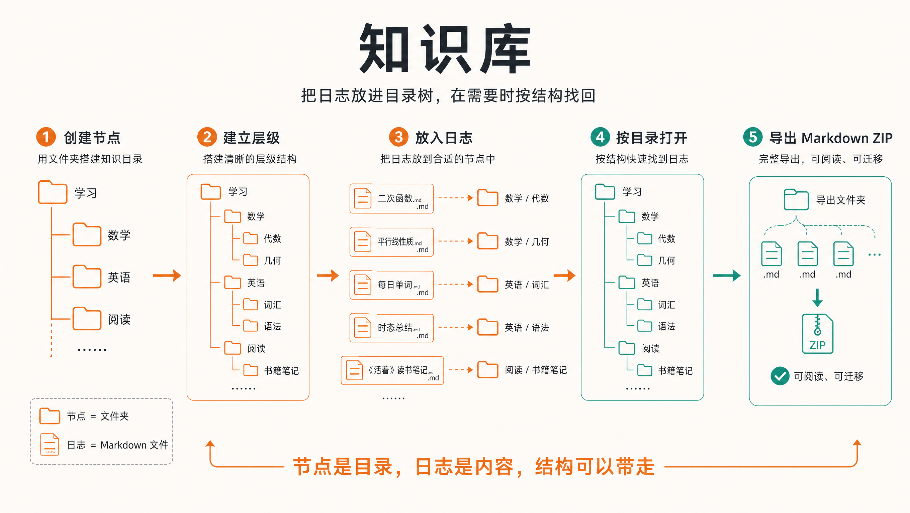
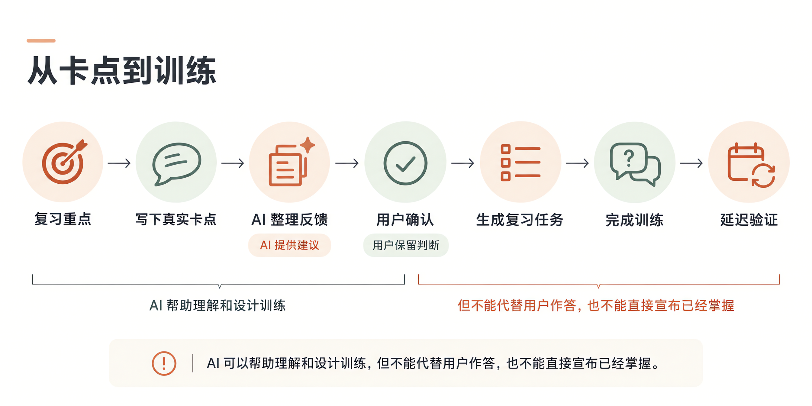

# StudyJournal / 学习日志

**把学过的内容留下，再在需要的时候重新想起来。**

[](https://github.com/a1234tuan/StudyJournal/actions/workflows/ci.yml)
[](LICENSE)
[](https://github.com/a1234tuan/StudyJournal/releases/latest)

学习日志是一款本地优先的个人学习应用，支持 **Android、Windows 和 Web**。它把学习记录、间隔复习、主动回忆与 AI 辅助训练连成一条路径，适合长期自学、备考和课程复盘。

你不必一开始就把笔记拆成闪卡，也不必先配置 AI。先记录自己的理解，再通过回忆找出卡点，最后进行针对性练习和延迟验证。**基础记录与复习无需登录，不依赖 AI 服务。**

[下载安装](#下载安装) · [快速开始](#快速开始) · [功能与使用方法](#功能与使用方法) · [数据与备份](#数据与备份) · [常见问题](#常见问题) · [从源码运行](#从源码运行)



> 本文按 APP 内“更多 → 使用教程”整理，并补充当前版本的今日计划、知识库、OCR 任务状态和语音服务说明。插图为应用内的流程说明，并非界面截图。更新日期：2026-09-25。

## 下载安装

前往 **[最新 GitHub Release](https://github.com/a1234tuan/StudyJournal/releases/latest)** 下载，也可查看[全部版本](https://github.com/a1234tuan/StudyJournal/releases)。

- **Android**：下载 APK，在手机上安装；升级时优先使用同签名安装包直接覆盖安装。
- **Windows x64**：下载 EXE 安装程序，安装后从桌面或开始菜单打开，无需单独运行服务器。
- **Web**：从源码运行或自行部署；原生录音、文件访问和真实语音服务的支持范围与客户端不同。
- **校验文件**：发布附件中的 `SHA256SUMS.txt` 用于核对安装包完整性。

**升级、卸载或换设备前，请先导出完整备份。** 不要通过卸载重装解决数据问题，以免丢失本地记录。Windows 安装包未做代码签名，系统可能显示安全提示；请核对下载来源与校验值。

本仓库公开发布标识仍为 **v0.2.5**；当前源码收口日期为 **2026-09-25**，Windows 最终构建仍沿用内部版本 **0.1.6**。发布标识、源码收口日期和平台内部版本不是同一套编号，请以 Release 附件、构建记录和 SHA-256 判断产物，而不是只看应用显示的版本号。Windows 安装包使用 Git LFS 保存，未安装代码签名证书。

## 快速开始

第一次使用，先完成一次最短闭环：

1. **记一条**：在“今天”新建日志，选择学科，写下概念、例子、易错点和自己的理解。Android 底部“+”先打开学科选择，确认后才创建日志。
2. **加入复习**：保存后，将值得回看的日志加入复习；需要针对性训练的内容可以标记为“复习重点”。
3. **先回忆**：到期后打开“复习”，先在脑中或口头尝试复述，再查看正文、核对遗漏。
4. **再评分**：按这一次的真实表现选择“忘记了 / 模糊 / 良好 / 轻松”，由系统安排下次复习。
5. **留好备份**：在“更多 → 备份与恢复”导出一份完整备份，再按需要配置自动备份或云同步。

AI、OCR、语音和知识播客都是扩展能力，不是开始学习的前置条件。

## 功能与使用方法

### 1. 记录与整理：保留完整的学习现场

一条日志可以同时保存文字、图片、录音、附件、公式、代码块，以及其他日志的引用。不必在“完整笔记”和“可复习内容”之间二选一。

- **组织内容**：使用任务列表、折叠块、结构图、对照表和便签板整理复杂知识。
- **分类与查找**：学科建立稳定目录，标签连接细分主题；在“日志”浏览、筛选、搜索与收藏。
- **复用结构**：将重复使用的记录格式保存为模板，新建时直接套用。
- **图片文字**：在“更多 → OCR 设置”配置服务后进行识别，已识别文本可参与检索和 AI 上下文；未识别、排队、失败和超时任务也在同一页集中查看和重试。
- **集中回听**：Desktop 从“更多 → 录音库”查找日志录音和知识播客；原始内容仍关联对应日志。Desktop 左侧导航现在用于进入知识库，Android 导航不变。
- **批量与导出**：选择多条日志加入复习或导出；单条日志也支持 Markdown、HTML、TXT 可读导出。
- **删除与恢复**：删除的日志先进入回收站，保留 30 天；永久删除后无法找回。

### 2. 今日计划：从准备做什么，到实际做了什么

从“今天”页面的“今日计划”，或“更多 → 今日计划”进入。按学科列出当天准备完成的内容，再从计划条目进入日志，记录实际过程、结果或卡点。

**保存有效日志后，计划才显示为已完成。** 创建计划本身不会自动生成日志，也不等同于完成学习。计划标题会保留，历史页只展示有计划的日期，完成统计来自实际日志。



计划用于记录意图与兑现情况，不替代复习评分；基于计划的 AI“意图与兑现”反馈仍未实现，不应当作当前功能。

### 3. 知识库：把日志放进目录树

知识库使用专题、节点和日志引用组织长期学习资料。节点表达目录层级，日志保留原始内容、复习状态和学习语义；一条日志可以被多个节点引用。

- **Desktop 入口**：从左侧导航进入；日志界面的知识库入口和“更多 → 知识库”仍然保留。
- **节点与日志**：节点可以建立父子层级，日志可以放入一个或多个节点；组织关系不会改写日志正文或复习事实。
- **目录树导出**：在知识库顶部“更多操作”中选择“导出知识库”，生成按节点目录排列的 Markdown ZIP。
- **导出结构**：节点对应文件夹，日志对应 Markdown 文件，图片等附件放在 ZIP 的 `assets/` 目录；未加入节点的日志放入 `_未归类`。
- **边界**：知识库导出用于阅读、迁移和长期保存，不等同于“更多 → 备份与恢复”中的完整应用备份。



### 4. 间隔复习：先回忆，再决定下次何时见

进入“复习”后，先主动回忆，再对照正文。评分按钮下方显示预计下次复习时间。

- **轻回看**：默认策略，适合长日志、课程复盘、总结和材料型内容，间隔相对宽松。
- **记忆卡**：适合定义、公式、易错点和短问答，使用 FSRS 安排按天复习。
- **评分与撤回**：评分描述当前回忆表现，不代表永久掌握；应用未退出时，切换页面后仍可撤回评分。
- **只读批注**：在复习正文上使用笔迹、高亮、图形和文字辅助思考，不改动原始日志。
- **真实卡点**：如果日志含复习重点，可以留下具体反馈，为后续学习助教训练提供依据。

批注草稿只在本机保留；评分成功后清除，撤回评分不会恢复旧批注。整条日志的评分调整复习时间，不直接宣布某个知识点已掌握。

### 5. 学习助教：把“哪里不会”变成一次具体训练

入口：**复习 → 学习助教**。

1. 为复习重点写下真实卡点，例如“能背出公式，但不知道什么时候使用”。
2. 查看并确认 AI 整理的理解，再发起分析。
3. 完成生成的针对性训练，亲自作答、查看反馈。
4. 在之后的延迟验证中再次检验，而不是把即时答对当作长期保持。

作答时可添加最多四张图片：根据配置交给视觉模型，或先进行本机 OCR 再评估。图片只用于本轮评估，不写入正式学习事实。AI 回复支持 Markdown、公式、带语法高亮和复制操作的代码块；材料预览保留公式与结构内容。



AI 帮助整理反馈和设计练习，不能替代你的判断，也不会擅自改写整条日志的复习评分。

### 6. AI 问答、语音复述与知识播客

同一份资料，可以选择不同的学习动作：提问、表达或聆听。

**AI 问答** — 从“更多 → AI 问答”进入，选择日志范围后追问、解释、抽测或辨析。可从这些问题开始：

> 根据这些日志考我，先不要给答案。
>
> 找出我最容易误以为已经理解的三个地方。

在“更多操作 → AI 设置”配置模型服务；需要把资料用于其他工具时，可导出 Markdown、JSON 或 TXT。这些是阅读与问答材料，不是可恢复的应用备份。

**语音复述** — 从复习页或只读日志进入，把知识讲出来，让 AI 逐轮追问。使用独立可选的 **ASR（语音识别）→ LLM（理解与回复）→ TTS（语音合成）** 链路。

- 在开始页选择资料与三个服务环节，填写本机凭据，并确认外发数据范围。
- 支持自动听说半双工模式，也保留手动语音与键盘输入；半双工是轮流听说，不是全双工随时插话。
- 回复采用最多两段有限 TTS 预取，减少分段等待；这不等于承诺任何网络下都无间断。
- 当前通话内可以点击已生成回复重播，复用内存音频，不重复发起 TTS 合成；可查看缓存占用、手动清理，结束通话后释放。
- 自由练习不会自动评分或改写原笔记；需要长期保留时，主动整理为正式日志。本机通话历史不能替代备份。

当前预置涵盖阿里云 Paraformer、独立 NLS 识音石和豆包 ASR；TTS 可选择 Fish Audio、百炼 Qwen Audio 3.1/3.0 或豆包语音合成 2.0。**预置存在不等于每个平台和每种账号均已验证。** 三款替代 TTS 已完成受控 Android“键盘确认输入 → 真实 LLM → TTS 播放”、缓存重播与清理检查；这不代表麦克风 ASR、多轮弱网、长会话和账单全部验收通过。Web 端也不承诺所有真实服务直连。

配置与限制请看[语音服务配置](docs/voice-recall-provider-configuration.md)、[真机验收记录](docs/voice-recall-tts-device-validation-2026-09-21.md)和[语音发布检查表](docs/voice-recall-release-checklist.md)。服务费用、免费额度和凭据有效期以服务商账号为准；应用不承诺免费调用。

**知识播客** — 从“更多 → 知识播客”进入，选择知识范围，先生成并编辑脚本，再按章节生成与播放音频。需要配置对应 AI 与 TTS 服务，适合整理和回听，不替代主动回忆与复习评分。

### 7. 学习状态与阅读偏好

- 在“更多 → 统计”查看待复习、逾期、完成进度和带样本量的回忆表现。
- 在“更多 → 设置”选择“温润阅读”或“清爽现代”视觉风格，并独立设置浅色、深色或跟随系统。
- 可调整界面字号、日志正文字号、行距和目标日期；界面字号影响导航与控件，正文字号影响日志编辑、详情和复习阅读区。
- 完整的任务导向说明在“更多 → 使用教程”，包含章节目录与按任务查找入口。

## 数据与备份

> 2026-09-25 源码收口：知识库已接入一键同步和目录树 Markdown ZIP 导出。电脑保存后同步，手机使用同一账号同步即可拉取；正常流程不再选来源或手动复制。旧来源只读保留，恢复副本不自动上传。知识库导出用于阅读与迁移，不替代完整备份；部署及真机验收状态见 [实施记录](docs/knowledge-library-one-click-sync-implementation-2026-09-25.md)。

### 本地优先，不等于自动跨设备共享

核心学习数据保存在当前设备。Windows、Android 和浏览器的数据相互独立，不会因为使用同一个应用就自动共享。基础记录和复习无需云账号。

浏览器数据按站点地址隔离：不同域名、端口，以及 `localhost` 与 `127.0.0.1` 都可能对应不同的本地库。请固定使用同一访问地址；清除站点数据、应用数据或卸载应用可能导致本地内容丢失。

### 分清备份、同步和材料导出

- **完整 ZIP 备份**：在“更多 → 备份与恢复”导出，用于学习数据的迁移、归档与恢复。导入会覆盖当前本地数据，操作前先另存一份当前备份。
- **Android 自动备份文件夹**：资源独立保存，仅补齐新增或缺失资源，保留最近 5 个快照。应用打开后执行备份同步；编辑后如需立即备份，手动点击“立即同步”。恢复旧仓库需使用“从自动备份文件夹恢复”，仅绑定文件夹不会自动导入。
- **可选云同步**：通过 Google 登录使用 Firebase 同步，在需要时显式触发；不是实时协同编辑，也不能替代独立备份。
- **日志互通**：用于选择性迁移日志，不等同于完整恢复。
- **知识库导出**：在知识库“更多操作”中导出目录树 Markdown ZIP；节点是文件夹，日志是 Markdown 文件，附件集中在 ZIP 的 `assets/` 目录。
- **AI 材料导出**：用于阅读与问答，不用于恢复应用数据。

换机时先从旧设备导出，在新设备导入并核对记录和附件，确认无误后再清理旧设备。

### 哪些内容不会随备份或同步迁移

- API 密钥、OCR 凭据和设备本地服务配置需在新设备重新填写；自定义 AI 提示词与原始服务响应也不随备份或同步迁移。
- 复习批注草稿只保存在当前设备，不进入日志正文、云同步、备份或导出。
- 语音临时会话和主动保留的本机通话历史不进入云同步或备份；回复音频缓存仅在当前通话内存中存在。
- 知识播客记录与生成音频不进入云同步或可移植备份。

### 外部服务与隐私

云同步会包含普通日志编辑草稿（不同于复习批注草稿）、回收站中的可恢复内容、决策块历史归档，以及正式助教实体中的模型与执行诊断信息。资源导出目前包含所有未标记为播客生成的普通资源，不以“当前页面仍引用”为筛选条件；不要将暂时未引用的文件直接视为可删除缓存。

日志正文字号属于本机设置，不随云同步或备份迁移。图片 OCR 文本参与云同步，但识别队列状态、任务 ID、错误和结果摘要留在本机；已经保存的有效识别文本不会因本机一次重试失败而退出 AI 上下文。历史云端副本不会因客户端升级立即被清除。

启用 AI、OCR、ASR 或 TTS 后，处理所需的文字、图片或音频会发送给你配置的服务商。**“凭据只保存在本机”不代表请求内容不会离开设备。** 服务可用性、数据保留政策与费用以服务商为准。

请勿在公开 Issue、截图或日志中包含密钥、备份文件或真实学习资料。更多说明见[语音隐私边界](docs/voice-recall-privacy.md)。

## 常见问题

- **不知道从哪里开始？** 先在“今天”记一条日志，再加入复习；不用先配置全部扩展服务。
- **AI 无法开始？** 检查“AI 问答 → 更多操作 → AI 设置”中的供应商、API Key 和模型；语音场景还需分别检查 ASR 与 TTS。
- **语音识别没有反应？** 先检查麦克风权限、所选服务凭据、网络及界面诊断信息。NLS 使用独立 AppKey 与临时 Token，不与百炼 API Key 混用。请按[配置说明](docs/voice-recall-provider-configuration.md)排查，不要反复盲目重试真实服务。
- **图片内容搜索不到？** 在“更多 → OCR 设置”检查配置，并在图片资源中重新识别；图片存在不代表已有 OCR 文本。
- **计划没有变成已完成？** 需要进入计划并保存实际有效日志，仅填写计划标题不会算完成。
- **换设备后密钥不见了？** 这是本机凭据边界，需要在新设备重新配置。
- **录音在哪里？** 打开“更多 → 录音库”，也可以回到对应日志；Desktop 左侧导航现在用于进入知识库。
- **为什么版本号看起来没变？** 本次发布沿用平台内部版本，请核对 Release 中的安装包和 SHA-256；不要为刷新版本号而卸载重装。

## 从源码运行

使用 Node.js 24 和 npm，在项目根目录执行：

```powershell
npm ci
npm run dev
```

按终端提示打开开发地址。Windows 用户安装依赖后，也可双击根目录的 `启动网页版.cmd`，固定使用 `http://127.0.0.1:5173`。

### 构建

```powershell
# Web 静态产物输出到 dist/
npm run build

# 本机预览 Web 构建，不是生产部署服务器
npm run preview

# Windows x64 安装包输出到 release/desktop/
npm run desktop:build

# Android APK，需要 Android SDK、JDK 21 与本机签名配置
npm run android:build:release
```

原生打包需要对应平台工具链。Android 脚本通过 PowerShell 运行，并自动构建、同步 Web 资源；不要提交签名文件或服务凭据。

自行部署云同步时，请使用自己的 Firebase、Google OAuth 和 Android 配置，并正确部署、验证 Firestore 与 Storage 安全规则。只配置客户端参数不等于完成安全部署。

验证命令与开发要求见[贡献指南](CONTRIBUTING.md)。普通自动化测试排除真实 Provider 调用；真实服务测试需单独授权，避免意外消耗额度。

## 项目状态与文档

**截至 2026-09-21，StudyJournal 处于维护阶段，并保留已批准的限定范围演进。** 本仓库保持学习日志品牌、应用标识、签名兼容性与数据路径，不原地改名。

今日计划已在本仓库内实现；2026-09-17 的范围修订允许后续在这里开发计划 AI 反馈，但该反馈层尚未实现。独立的 Exocortex 产品仍应使用独立目录与仓库，不能把历史冻结说明理解为今日计划已迁出。

- [文档索引](docs/README.md)：产品边界、接入说明、当前验收与历史资料入口。
- [维护构建交接](docs/release-handoff-2026-09-21.md)：本次 APK/EXE 校验值、测试结果、手机安装与未验收项。
- [维护冻结基线](docs/studyjournal-final-freeze-2026-09-15.md)与[今日计划范围修订](docs/studyjournal-scope-unfreeze-2026-09-17.md)：维护及例外范围。
- [更新日志](CHANGELOG.md)：版本变化；具体安装包说明以 Release 为准。

已通过的自动化测试或局部真机验收不代表全部平台、服务商、弱网和真实账单场景均已通过。

## 贡献与反馈

- 使用问题与功能建议：[GitHub Issues](https://github.com/a1234tuan/StudyJournal/issues)。
- 开发环境、验证命令与提交要求：[贡献指南](CONTRIBUTING.md)。
- 漏洞与敏感问题：[安全政策](SECURITY.md)，请勿公开提交敏感数据。

## 许可证

本项目采用 [MIT License](LICENSE)。第三方依赖分别遵循各自许可证。
