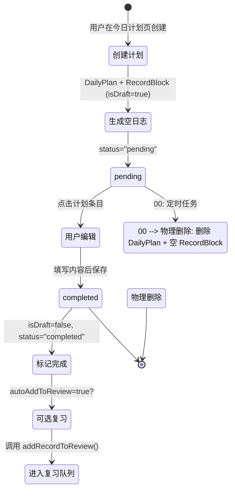

# 学习计划功能设计方案 v2.0

> 基于用户反馈的修正版本

## 一、核心需求重新确认

### 1.1 用户意图核心
建立 `计划 → 日志 → 复习 → AI 反馈` 的完整闭环：

1. **今日计划，今日有效**：计划只在创建当天有效，次日自动清理
2. **执行即填充**：点击计划进入日志编辑器填写内容
3. **未填即消失**：次日未填充的计划自动删除，不留痕迹
4. **填充即完成**：有内容的日志 = 已完成，可以正常编辑、删除、加入复习

### 1.2 关键修正
- ❌ **不存在跨日期场景**：今日计划只在今日有效
- ✅ **空日志自动删除**：未填写的计划不占用日志空间
- ✅ **一个计划一个日志**：但支持当天多次编辑

---

## 二、现有架构正确理解

### 2.1 导航结构（已修正）

#### 安卓端（4个底部Tab）
```
┌────────┬────────┬────────┬────────┐
│  今天  │  日志  │  复习  │  更多  │
└────────┴────────┴────────┴────────┘
```

#### Desktop 端（左侧Tab）
```
┌─────────────┐
│    今天     │
│    日志     │
│    复习     │
│    录音     │  ← Desktop 独有
│    更多     │
├─────────────┤
│  分类管理   │
│    设置     │
└─────────────┘
```

**结论**：
- ✅ "今日计划"入口放在"今天"界面右上角（安卓&Desktop通用）
- ✅ 位置：与"今天想记下什么？"同一行右侧（已实现）

### 2.2 云同步范围（已明确）

**查看代码发现**：`createCloudSyncSnapshot()` 包含以下数据：

```typescript
// 参与云同步的数据
- entries           ✅
- blocks            ✅
- templates         ✅
- tags              ✅
- studySessions     ✅
- recordReviews     ✅
- recordReviewLogs  ✅
- recordReviewDayStats ✅
- reviewCoach       ✅ (AI驾驶舱数据)
  - decisionBlocks
  - decisionBlockArchives
  - decisionBlockFeedback
  - analysisQueueItems
  - ...
- assets            ✅ (但不包括 knowledge-podcast 生成的)
```

**AI 驾驶舱数据是参与云同步的！**

**关键发现**：
- `reviewCoach` 数据（决策块、反馈、分析队列）**全部参与云同步**
- 这意味着 AI 驾驶舱的学习闭环数据在多设备间保持同步

**结论**：
- ✅ **DailyPlan 数据应该参与云同步**
- ✅ 需要在 `createCloudSyncSnapshot()` 中添加 `dailyPlans` 字段
- ✅ 需要在 `exportCloudSync()` 中处理 `DailyPlan` 实体

### 2.3 AI 驾驶舱定义（已明确）

**用户定义的"AI 驾驶舱"**：
```
创建包含决策块的日志
      ↓
    复习评分
      ↓
  AI 反馈分析
      ↓
   训练/延迟验证
      ↓
  （回到复习）
```

**当前实现**（从代码分析）：
- `AdaptiveReviewPage.tsx` - 学习助教（自适应复习任务）
- `ReviewCoachWorkbench.tsx` - 复习教练工作台（决策块反馈、分析队列）
- 这些功能在 `ReviewPage` 中通过 `coachOpen` 状态切换显示

**问题**：
- 当前"AI 驾驶舱"功能**分散**在复习页面中
- 没有统一的入口查看完整的学习闭环数据
- 统计页面（StatsPage）**只显示复习数据**，没有 AI 分析维度

---

## 三、数据模型设计（修正版）

### 3.1 新增：DailyPlan 表

```typescript
export interface DailyPlan extends BaseEntity {
  date: ISODate;                // 计划日期（必须是创建当天）
  subject: Subject;             // 所属学科
  title: string;                // 计划标题
  order: number;                // 同一天内的排序
  linkedRecordId?: EntityId;    // 关联的日志 ID（完成后填入）
  completedAt?: ISODateTime;    // 完成时间戳
  status: "pending" | "completed";  // 简化状态（只有两种）
  
  // 可选：复习相关
  autoAddToReview?: boolean;    // 完成后是否自动加入复习
  reviewKind?: RecordReviewKind; // 复习类型
}
```

**状态简化理由**：
- ❌ 删除 `"abandoned"` 状态
- ✅ 未完成的计划次日自动物理删除，不需要"abandoned"状态留痕

### 3.2 修改：RecordBlock 表

```typescript
export interface RecordBlock extends BaseEntity {
  // ... 现有字段
  planId?: EntityId;  // 新增：关联的计划 ID
  isDraft?: boolean;  // 新增：标记为草稿（计划生成的空日志）
}
```

**isDraft 字段用途**：
- 过滤"最近日志"列表时使用
- `isDraft === true` 的记录不显示在首页列表中

### 3.3 数据生命周期（严格"今日有效"）



**关键时间点**：
1. **创建时（当天）**：生成 `DailyPlan` + 空 `RecordBlock` (isDraft=true)
2. **编辑时（当天）**：更新 `RecordBlock.contentHtml`，设置 `isDraft=false`，`DailyPlan.status="completed"`
3. **次日 00:00**：定时任务删除 `status="pending"` 的 DailyPlan 及其空 RecordBlock

**与之前方案的区别**：
- ❌ 不保留"abandoned"状态
- ✅ 物理删除未完成的计划和空日志
- ✅ 不存在"次日填写"场景

### 3.4 边界情况处理

#### 情况1：创建后点开但未编辑
```
DailyPlan: status="pending", linkedRecordId="record-123"
RecordBlock: id="record-123", contentHtml="<p></p>", isDraft=true
```
**次日处理**：物理删除 DailyPlan 和 RecordBlock

#### 情况2：编辑后又删除了所有内容
```
RecordBlock: contentHtml="<p></p>" （经过编辑但又清空了）
```
**判断逻辑**：
```typescript
const isEmpty = (html: string) => {
  const stripped = html.replace(/<[^>]*>/g, '').trim();
  return stripped.length === 0;
};

// 如果内容为空，视为未完成
if (isEmpty(record.contentHtml)) {
  record.isDraft = true;
  plan.status = "pending";
}
```

#### 情况3：删除已完成的日志
```typescript
// 在 storageAdapter.deleteBlock 中
async deleteBlock(blockId: EntityId): Promise<void> {
  const block = await db.blocks.get(blockId);
  if (block?.type === "record" && block.planId) {
    // 同步删除关联的计划
    await db.dailyPlans.delete(block.planId);
  }
  // ... 原有删除逻辑
}
```

---

## 四、界面流转设计（修正版）

### 4.1 完整用户流程

```
┌─────────────────────────────────────────────────┐
│ 1. 用户打开 APP，进入首页（TodayPage）          │
│    - 右上角看到"今日计划"按钮                   │
│    - 点击按钮                                   │
└─────────────────────────────────────────────────┘
                    ↓ (从右向左滑入动画)
┌─────────────────────────────────────────────────┐
│ 2. DailyPlanPage（今日计划页）                  │
│    ┌───────────────────────────────────────────┐│
│    │ [ ← ] 今日计划                    [+ 新建]││
│    │                                           ││
│    │ 📅 2026-09-16 周一                        ││
│    │                                           ││
│    │ ┌─────────────────────────────────────┐  ││
│    │ │ 数学 · 三大计算 50-60 题            │  ││
│    │ │ ⏱️ 未完成                            │  ││
│    │ └─────────────────────────────────────┘  ││
│    │                                           ││
│    │ ┌─────────────────────────────────────┐  ││
│    │ │ 英语 · 单词背诵 List 10             │  ││
│    │ │ ✅ 已完成 · 14:30                   │  ││
│    │ └─────────────────────────────────────┘  ││
│    │                                           ││
│    └───────────────────────────────────────────┘│
└─────────────────────────────────────────────────┘
                    ↓ (点击"数学"条目)
┌─────────────────────────────────────────────────┐
│ 3. RecordEditorPage（复用现有日志编辑器）       │
│    - 打开对应的 RecordBlock                     │
│    - 用户填写学习内容                           │
│    - 保存后自动更新 DailyPlan.status            │
└─────────────────────────────────────────────────┘
                    ↓ (点击左上角返回)
┌─────────────────────────────────────────────────┐
│ 4. 返回 DailyPlanPage                           │
│    - 看到"数学"条目状态变为"已完成"             │
└─────────────────────────────────────────────────┘
                    ↓ (再次点击返回)
┌─────────────────────────────────────────────────┐
│ 5. 返回 TodayPage（首页）                       │
└─────────────────────────────────────────────────┘
```

### 4.2 页面间跳转关系

```mermaid
graph LR
    A[TodayPage] -->|点击"今日计划"<br/>从右滑入| B[DailyPlanPage]
    B -->|点击计划条目<br/>从右滑入| C[RecordEditorPage]
    C -->|点击返回<br/>从左滑出| B
    B -->|点击返回<br/>从左滑出| A
    A -->|点击"统计"Tab| D[StatsPage]
    D -->|未来：点击AI分析| E[AiCockpitPage?]
```

### 4.3 动画效果

**从右向左滑入**（forward 动画）：
- TodayPage → DailyPlanPage
- DailyPlanPage → RecordEditorPage

**从左向右滑出**（back 动画）：
- RecordEditorPage → DailyPlanPage
- DailyPlanPage → TodayPage

**实现**：复用现有 `PageTransition` 组件的 `motion` prop

---

## 五、统计与 AI 驾驶舱设计

### 5.1 当前状态分析

**StatsPage 现有内容**：
```
┌─ 学习状态 ────────────────────────────────┐
│ [现在] 需要行动                            │
│  - 今日待复习：X 条                        │
│  - 今日完成进度：Y%                        │
│  - 逾期积压：Z 条                          │
│                                            │
│ [近期] 学习状态                            │
│  - 近 7 天回忆成功率：XX%                  │
│  - 近 30 天回忆成功率：XX%                 │
│  - 连续复习：N 天                          │
│                                            │
│ [历史] 查看历史记录                        │
│  - 热力图                                  │
│  - 回忆成功率变化                          │
└────────────────────────────────────────────┘
```

**问题**：
- ❌ 只显示复习维度，没有计划完成度
- ❌ 没有 AI 分析维度（学习模式、拖延检测等）
- ❌ 没有"学习闭环"的整体视图

### 5.2 方案 A：扩展 StatsPage（推荐初期）

**新增"计划完成"section**：
```
┌─ 学习状态 ────────────────────────────────┐
│ [现在] 需要行动                            │
│  - 今日待复习：X 条                        │
│  - 今日计划：Y / Z 完成        ← 新增     │
│  - 今日完成进度：Y%                        │
│                                            │
│ [近期] 学习状态                            │
│  - 近 7 天回忆成功率：XX%                  │
│  - 近 7 天计划完成率：XX%      ← 新增     │
│  - 连续复习：N 天                          │
│  - 连续完成计划：M 天          ← 新增     │
└────────────────────────────────────────────┘
```

**优势**：
- ✅ 与现有统计功能一致
- ✅ 开发成本低
- ✅ 用户自然地在"统计"Tab 查看

**劣势**：
- ⚠️ 页面会变得更复杂
- ⚠️ 没有 AI 分析维度

### 5.3 方案 B：新增独立的"AI 驾驶舱"页面（推荐后期）

**位置**：More Tab → "aiCockpit" 子路由

**页面结构**：
```
┌─ AI 驾驶舱 ───────────────────────────────┐
│ 📊 本周学习全景                            │
│                                            │
│ [执行层面]                                 │
│  计划完成率：75% (15/20)                  │
│  复习完成率：90% (27/30)                  │
│  学习连续性：5 天                          │
│                                            │
│ [效果层面]                                 │
│  回忆成功率：82% ↑ 较上周提升              │
│  决策块通过率：65%                         │
│  AI 反馈响应率：100%                       │
│                                            │
│ [模式洞察]                                 │
│  💡 你在周末的计划完成率明显高于工作日     │
│  💡 来自计划的日志，复习时回忆成功率更高   │
│  💡 数学计划完成率 80%，英语只有 40%       │
│                                            │
│ [调整建议]                                 │
│  1. 减少每日计划数量（当前平均 4 个）      │
│  2. 增加英语学习时间占比                   │
│  3. 工作日计划宜精不宜多                   │
│                                            │
│ [学习闭环追踪]                             │
│  - 待反馈决策块：3 个                      │
│  - 待验证延迟任务：2 个                    │
│  - 本周完成闭环：8 个                      │
└────────────────────────────────────────────┘
```

**数据来源**：
1. **计划数据**：`DailyPlan` 表
2. **复习数据**：`RecordReviewState` + `RecordReviewLog`
3. **AI 驾驶舱数据**：`reviewCoach.decisionBlocks` + `feedback` + `analysisQueueItems`

**优势**：
- ✅ 完整的学习闭环视图
- ✅ 整合计划、复习、AI 反馈三个维度
- ✅ 可以深入展示 AI 分析结果
- ✅ 未来可以扩展对话式反馈

**劣势**：
- ⚠️ 需要新增一个 More 子路由
- ⚠️ 开发成本较高
- ⚠️ 用户需要学习新入口

### 5.4 推荐方案：分阶段实施

**Phase 1（MVP）**：扩展 StatsPage
- 在"需要行动"section 新增"今日计划：Y / Z 完成"
- 在"学习状态"section 新增"近 7 天计划完成率"
- 新增"连续完成计划天数"

**Phase 2（AI 分析）**：在 StatsPage 底部新增"AI 洞察"section
- 显示 3-5 条简短的 AI 发现（如"周末完成率更高"）
- 点击"查看详细分析"跳转到独立页面

**Phase 3（独立驾驶舱）**：新增 AiCockpitPage
- More Tab → "aiCockpit" 子路由
- 整合计划、复习、AI 反馈的完整视图
- 提供深度分析和对话式建议

### 5.5 关于"学习助教"的处理

**当前位置**：复习页面（ReviewPage）→ 点击"学习助教"按钮 → 打开 `ReviewCoachWorkbench`

**问题**：
- "学习助教"是 AI 驾驶舱的一部分（决策块反馈、AI 分析）
- 但入口隐藏在复习页面中，用户可能找不到

**建议**：
- **Phase 1-2**：保持现状，不移动"学习助教"
- **Phase 3**：将"学习助教"集成到 AiCockpitPage 中
  - AiCockpitPage 显示概览
  - 点击"决策块反馈"跳转到 ReviewCoachWorkbench
  - 或者：在 AiCockpitPage 中嵌入 ReviewCoachWorkbench 的核心功能

---

## 六、技术实现细节

### 6.1 数据库修改

#### 新增表：dailyPlans
```typescript
// src/db/database.ts
class StudyJournalDb extends Dexie {
  // ... 现有表
  dailyPlans!: Table<DailyPlan, EntityId>;
  
  constructor() {
    super("StudyJournalDb");
    this.version(X).stores({
      // ... 现有表
      dailyPlans: "id, date, subject, linkedRecordId, createdAt, updatedAt",
    });
  }
}
```

#### 修改表：blocks
```typescript
// 需要新增索引
blocks: "id, type, date, subject, order, createdAt, updatedAt, deletedAt, planId, isDraft",
//                                                                         ^^^^^^  ^^^^^^^
//                                                                         新增    新增
```

### 6.2 云同步集成

#### 修改：createCloudSyncSnapshot()
```typescript
// src/services/storageAdapter.ts
async createCloudSyncSnapshot(): Promise<StorageSnapshot> {
  const snapshot = await db.transaction(
    "r",
    [
      db.entries, db.blocks, db.templates, 
      db.dailyPlans,  // 新增
      // ... 其他表
    ],
    async () => {
      const [entries, blocks, templates, dailyPlans, ...] = await Promise.all([
        db.entries.toArray(),
        db.blocks.toArray(),
        db.templates.toArray(),
        db.dailyPlans.toArray(),  // 新增
        // ...
      ]);
      return { 
        entries, blocks, templates, dailyPlans,  // 新增
        // ...
      };
    },
  );
  
  return {
    payload: {
      // ...
      dailyPlans: snapshot.dailyPlans,  // 新增
    },
    assets: backupAssets,
    recordDrafts: cleanedDrafts,
  };
}
```

#### 修改：exportCloudSync()
```typescript
// src/services/cloudSyncModel.ts
export const exportCloudSync = async (snapshot: StorageSnapshot): Promise<CloudSyncExport> => {
  const ordinary = await Promise.all([
    mapEntities("entry", snapshot.payload.entries),
    mapEntities("block", snapshot.payload.blocks),
    mapEntities("daily-plan", snapshot.payload.dailyPlans ?? []),  // 新增
    // ...
  ]);
  
  return { 
    entities: [...ordinary.flat(), settings, ...assets], 
    reviewEvents, 
    assetBlobs 
  };
};
```

#### 新增：CloudSyncEntityType
```typescript
// src/services/cloudSyncModel.ts
export type CloudSyncEntityType =
  | "entry"
  | "block"
  | "template"
  | "daily-plan"  // 新增
  // ...
```

### 6.3 定时任务实现

#### 方案 A：APP 启动时触发
```typescript
// src/App.tsx useEffect
useEffect(() => {
  const cleanupUnfinishedPlans = async () => {
    const yesterday = new Date();
    yesterday.setDate(yesterday.getDate() - 1);
    const yesterdayISO = yesterday.toISOString().split('T')[0];
    
    // 获取昨天及之前未完成的计划
    const unfinishedPlans = await storage.listDailyPlans(yesterdayISO);
    
    for (const plan of unfinishedPlans) {
      if (plan.status === "pending" && plan.linkedRecordId) {
        // 检查日志是否为空
        const record = await storage.getBlock(plan.linkedRecordId);
        if (record && isEmpty(record.contentHtml)) {
          // 删除空日志
          await storage.deleteBlock(plan.linkedRecordId);
        }
      }
      // 删除计划
      await storage.deleteDailyPlan(plan.id);
    }
  };
  
  cleanupUnfinishedPlans();
}, []);
```

#### 方案 B：后台定时任务（需要原生支持）
```typescript
// 使用 Capacitor 的后台任务 API
// 需要配置权限和 Worker
```

**推荐**：方案 A（APP 启动时触发）
- 简单可靠
- 不需要后台权限
- 用户每天至少打开一次 APP

### 6.4 路由集成

#### 修改：src/lib/tabNavigation.ts
```typescript
export type TabMemory = {
  today: RecordTabState & { 
    adaptiveTaskId?: EntityId;
    dailyPlanOpen?: boolean;  // 新增：是否打开了今日计划页
  };
  // ...
};
```

#### 修改：src/App.tsx
```typescript
// 导航状态
const [todayDailyPlanOpen, setTodayDailyPlanOpen] = useState(false);

// 导航函数
const openDailyPlan = useCallback(() => {
  setTodayDailyPlanOpen(true);
  // 触发 forward 动画
}, []);

const closeDailyPlan = useCallback(() => {
  setTodayDailyPlanOpen(false);
  // 触发 back 动画
}, []);

// 页面渲染
{activeTab === "today" && (
  todayDailyPlanOpen ? (
    <DailyPlanPage
      plans={todayPlans}
      onBack={closeDailyPlan}
      onOpenRecord={(planId) => {
        // 跳转到日志编辑器
      }}
    />
  ) : (
    <TodayPage
      // ...
      onOpenDailyPlan={openDailyPlan}
    />
  )
)}
```

---

## 七、开放问题（需要用户决策）

### 问题 1：自动加入复习的策略
**选项 A**：所有完成的计划日志自动加入复习  
**选项 B**：创建计划时提供开关"完成后加入复习"  
**选项 C**：完成后询问用户是否加入复习

**推荐**：选项 B
- 给用户控制权
- 默认开启（可以在设置中配置默认值）

### 问题 2：计划的默认学科
**选项 A**：每次创建时手动选择  
**选项 B**：记住上次选择的学科  
**选项 C**：根据最近学习的学科智能推荐

**推荐**：选项 B + C 结合
- 记住上次选择
- 在下拉列表中将最近学习的学科排在前面

### 问题 3：AI 驾驶舱的独立时机
**选项 A**：Phase 1 就独立出来  
**选项 B**：先在 StatsPage 试水，Phase 2-3 再独立  
**选项 C**：永远不独立，全部集成在 StatsPage

**推荐**：选项 B
- 初期开发成本低
- 可以先验证用户对 AI 分析的接受度
- 后期根据反馈决定是否独立

### 问题 4：历史计划的查看
**选项 A**：只能查看今日计划  
**选项 B**：可以查看最近 7 天的计划历史  
**选项 C**：可以查看任意日期的计划历史

**推荐**：选项 B
- 允许用户回顾近期的计划执行情况
- 不需要复杂的归档机制

### 问题 5：计划与日志的关联显示
在日志详情页，是否显示"来自今日计划"的标识？

**选项 A**：不显示  
**选项 B**：显示标签"来自计划"  
**选项 C**：显示完整的计划信息（标题、创建时间等）

**推荐**：选项 B
- 轻量级标识
- 不影响日志的主要内容

---

## 八、实施路线图（修正版）

### Phase 1：核心功能（5-7 天）

**Week 1：数据层 + UI 基础**
- Day 1-2：数据模型
  - ✅ 定义 `DailyPlan` 接口
  - ✅ 新增 Dexie 表
  - ✅ 修改 `RecordBlock` 接口
  - ✅ 实现 CRUD 操作
  
- Day 3-4：UI 层
  - ✅ 创建 `DailyPlanPage` 组件
  - ✅ 实现计划列表
  - ✅ 实现新建计划表单
  - ✅ 集成到 TodayPage
  
- Day 5-6：业务逻辑
  - ✅ "创建计划时生成空日志"
  - ✅ "保存日志时更新计划状态"
  - ✅ "APP 启动时清理过期计划"
  - ✅ "删除日志时同步删除计划"
  
- Day 7：测试
  - ✅ 单元测试
  - ✅ 边界情况测试

### Phase 2：云同步集成（2-3 天）

- Day 8-9：云同步
  - ✅ 修改 `createCloudSyncSnapshot`
  - ✅ 修改 `exportCloudSync`
  - ✅ 修改 `materializeCloudSyncSnapshot`
  - ✅ 添加数据迁移逻辑
  
- Day 10：测试
  - ✅ 多设备同步测试
  - ✅ 冲突解决测试

### Phase 3：统计集成（2-3 天）

- Day 11-12：扩展 StatsPage
  - ✅ 计算计划完成率
  - ✅ 新增"今日计划"显示
  - ✅ 新增"近 7 天计划完成率"
  - ✅ 新增"连续完成计划天数"
  
- Day 13：测试
  - ✅ 统计数据正确性测试

### Phase 4（可选）：AI 分析集成（5-7 天）

- Week 3：AI 洞察
  - ✅ 设计分析算法
  - ✅ 实现模式识别（周末 vs 工作日）
  - ✅ 实现学科偏好分析
  - ✅ 在 StatsPage 显示简单洞察
  
- Week 4：独立驾驶舱（可选）
  - ✅ 创建 `AiCockpitPage`
  - ✅ 整合计划、复习、AI 反馈
  - ✅ 实现深度分析视图

**总计**：
- **核心功能（必须）**：10-13 天（约 2 周）
- **AI 分析（可选）**：额外 5-10 天

---

## 九、风险与缓解

### 9.1 技术风险

| 风险点 | 影响 | 缓解方案 |
|-------|------|---------|
| **云同步冲突** | 多设备计划不一致 | "最后写入胜出" + 冲突提示 UI |
| **定时清理失败** | 过期计划堆积 | APP 启动时补偿 + 手动清理入口 |
| **数据迁移失败** | 老用户升级后异常 | 完整的回滚机制 + 迁移前备份 |
| **isDraft 标记错误** | 空日志污染列表 | 多重过滤条件（contentHtml + isDraft） |

### 9.2 用户体验风险

| 风险点 | 影响 | 缓解方案 |
|-------|------|---------|
| **过度规划焦虑** | 用户列很多计划但完不成 | AI 提醒"建议减少计划数量" |
| **功能理解成本** | 不理解计划-日志绑定 | 新手引导 + 工具提示 |
| **遗忘填写** | 创建后忘记填写 | 晚上推送通知"还有 X 个计划" |

---

## 十、总结

### 10.1 核心设计决策

| 决策点 | 选择 | 理由 |
|-------|------|------|
| **数据模型** | 新增 `DailyPlan` + `RecordBlock.planId` | 保持数据独立性 |
| **状态模型** | 只有 `pending` 和 `completed` 两种状态 | 简化逻辑，过期计划物理删除 |
| **生命周期** | 严格"今日有效"，次日物理删除 | 符合用户澄清的需求 |
| **云同步** | 参与云同步 | 与其他核心数据一致 |
| **AI 驾驶舱** | 初期扩展 StatsPage，后期独立 | 渐进式开发，降低风险 |
| **入口位置** | TodayPage 右上角 | 安卓&Desktop 通用 |

### 10.2 与 v1.0 的主要区别

| 方面 | v1.0 | v2.0（本版本） |
|-----|------|---------------|
| **跨日期** | 允许次日填写 | ❌ 不允许，严格今日有效 |
| **状态模型** | `pending` / `completed` / `abandoned` | 只有 `pending` / `completed` |
| **过期处理** | 标记为 `abandoned` 保留 | 物理删除，不留痕迹 |
| **云同步** | 未明确 | ✅ 明确参与云同步 |
| **AI 驾驶舱** | 模糊定义 | ✅ 明确定义为完整学习闭环 |
| **导航结构** | Desktop 端理解错误 | ✅ 安卓/Desktop 分别明确 |

---

**文档版本**：v2.0  
**最后更新**：2026-09-16  
**作者**：Claude  
**状态**：待审查

## 附录：待讨论的细节

1. **计划的最大数量限制**：是否限制每天最多创建 N 个计划？
2. **批量创建**：是否支持一次性创建多个相似的计划？
3. **计划模板**：是否支持保存常用的计划模板？
4. **通知策略**：什么时间推送"还有未完成计划"的通知？
5. **统计维度**：除了完成率，还需要哪些统计维度？
