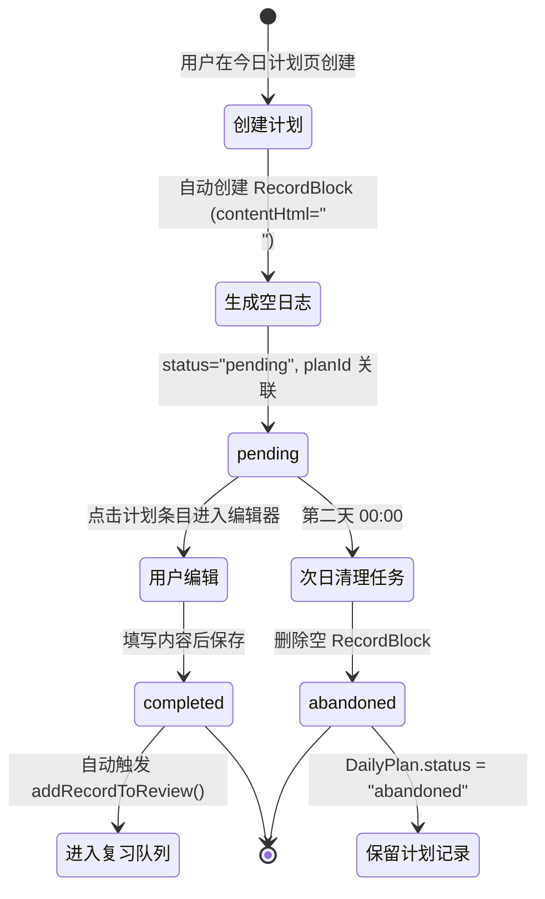

# 学习计划功能设计方案

## 一、核心需求理解

### 1.1 用户意图核心
建立一个**以计划为驱动的学习日志系统**，形成 `计划 → 日志 → 复习 → AI 反馈` 的完整闭环：

1. **计划即承诺**：创建计划时预生成日志记录槽位
2. **执行即填充**：完成计划时点击进入，填写具体学习内容
3. **放弃即清除**：次日未填充的槽位自动删除，只保留计划标题作为"未完成"记录
4. **完成即证据**：有日志内容 = 已完成，自动进入间隔复习队列

### 1.2 关键特征
- 计划与日志是**双向绑定**的关系，不是两个独立模块
- 未完成的计划需要**可追溯但不占用日志列表空间**
- AI 驾驶舱需要**从计划完成度推导学习模式**而非仅看复习数据

---

## 二、现有架构分析

### 2.1 导航结构（src/lib/tabNavigation.ts）
```typescript
export type TabKey = "today" | "journal" | "categories" | "review" | "more";

export const MORE_SUB_ROUTE_VALUES = [
  "stats", "settings", "ai", "favorites", "trash", 
  "backup", "aiTools", "aiExport", // ... 其他子路由
] as const;
```

**发现的问题**：
- 当前导航是 **5 个 Tab 固定结构**（今天、日志、分类、复习、更多）
- "更多" Tab 下已经有 **13 个子路由**，空间已接近饱和
- 底部导航（`bottomNavItems`）只显示 4 个主要 Tab，"更多"是最后的兜底入口

**结论**：
- ❌ **不能新增第 6 个主 Tab**，会破坏底部导航 4+1 的平衡
- ✅ **必须放在现有 Tab 的子路由下**

### 2.2 数据模型（src/types.ts）

#### 现有核心实体
```typescript
export interface RecordBlock extends BaseEntity {
  type: "record";
  date: ISODate;
  order: number;
  subject: Subject;
  title: string;
  contentHtml: string;
  // ...
}

export interface DayEntry extends BaseEntity {
  date: ISODate;
  title: string;
  tags: string[];
  pinned: boolean;
  favorite: boolean;
  summary?: string;
}

export interface RecordReviewState extends BaseEntity {
  recordId: EntityId;
  status: RecordReviewStatus;
  // 复习间隔、下次复习日期等
}
```

**关键发现**：
1. **RecordBlock 没有 `source` 或 `origin` 字段**，无法标记来源
2. **DayEntry 是日期级别的元数据**，不适合存储计划
3. **RecordReviewState 只关联 recordId**，不关心日志来源

### 2.3 存储适配器（src/services/storageAdapter.ts）
- 使用 **Dexie（IndexedDB）** 作为本地存储
- 数据表结构：`entries`, `blocks`, `templates`, `recordReviews`, `recordReviewLogs`, ...
- 支持 **云同步快照**（`createCloudSyncSnapshot`）

**结论**：
- ✅ 新增数据表技术上可行
- ⚠️ **需要考虑云同步兼容性**（新表需要加入快照逻辑）
- ⚠️ **迁移策略**（老数据没有 `planId`，如何处理？）

### 2.4 学习统计（src/lib/learningStats.ts）
```typescript
export interface LearningStatsSummary {
  dueCount: number;
  dueTodayCount: number;
  overdueCount: number;
  reviewedToday: number;
  dueAtFirstOpen: number;
  progress: number | null;
  recall7: RecallSummary;
  recall30: RecallSummary;
  streakDays: number;
}
```

**发现的问题**：
- 当前统计 **只基于复习数据**（`RecordReviewStats`）
- **没有"计划完成度"维度**
- **没有"学习主动性"指标**（是否按计划执行）

---

## 三、接入方案设计

### 3.1 数据模型设计

#### 新增：DailyPlan 表
```typescript
export interface DailyPlan extends BaseEntity {
  date: ISODate;                // 计划日期
  subject: Subject;             // 所属学科
  title: string;                // 计划标题（如"三大计算 660 题第 50 到 60 题"）
  order: number;                // 同一天内的排序
  linkedRecordId?: EntityId;    // 关联的日志 ID（完成后填入）
  completedAt?: ISODateTime;    // 完成时间戳
  status: "pending" | "completed" | "abandoned";  // 状态
}
```

#### 修改：RecordBlock 表
```typescript
export interface RecordBlock extends BaseEntity {
  // ... 现有字段
  planId?: EntityId;  // 新增：关联的计划 ID（可选，非计划日志为 null）
}
```

#### 新增：PlanCompletion 统计表（可选，用于性能优化）
```typescript
export interface PlanCompletion extends BaseEntity {
  date: ISODate;
  totalPlans: number;
  completedPlans: number;
  completionRate: number;
  subjectBreakdown: Array<{
    subject: Subject;
    total: number;
    completed: number;
  }>;
}
```

### 3.2 数据生命周期



**关键时间点**：
1. **创建时**：同时生成 `DailyPlan` + 空 `RecordBlock`
2. **编辑时**：更新 `RecordBlock.contentHtml`，触发 `DailyPlan.status = "completed"`
3. **次日 00:00**：定时任务扫描 `status="pending"` 且 `date < today` 的记录

### 3.3 界面接入方案

#### 方案评估：在哪里放入口？

| 位置选项 | 优势 | 劣势 | 推荐度 |
|---------|------|------|--------|
| 新增主 Tab | 访问最便捷 | ❌ 破坏导航平衡 | ⭐ |
| Today Tab 内嵌 | 职责相关 | ❌ 首页已经很满 | ⭐⭐ |
| More 子路由 | 扩展性强 | 访问路径较深 | ⭐⭐⭐⭐ |
| Journal Tab 集成 | 与日志联动紧密 | ❌ 语义不清晰 | ⭐⭐ |

**最终推荐**：`More Tab → "dailyPlan" 子路由`

**理由**：
1. 不破坏现有导航结构
2. 与 `stats`（统计）、`favorites`（收藏）在同一层级，语义一致
3. 可以独立设计页面布局，不受首页空间限制
4. 未来可以扩展为"周计划"、"月计划"等功能

#### 入口按钮位置

**首页（TodayPage）入口**：
- 位置：PageHeader 的 `titleActions`（已实现）
- 样式：文字按钮 "今日计划"
- 交互：点击跳转到 `More Tab → dailyPlan 子路由`

**统计页（StatsPage）入口**：
- 位置：在"学习状态"section 下方新增"计划完成"section
- 显示：本周计划完成率、连续完成天数
- 交互：点击数字跳转到详细页面

### 3.4 路由设计

#### 修改 `src/lib/tabNavigation.ts`
```typescript
export const MORE_SUB_ROUTE_VALUES = [
  "stats",
  "settings",
  "ai",
  "favorites",
  "dailyPlan",  // 新增
  "trash",
  // ... 其他
] as const;

export type TabMemory = {
  // ...
  more: RecordTabState & {
    subRoute: MoreSubRoute;
    // ... 其他状态
  };
};
```

#### 页面组件结构
```
src/pages/
  └── DailyPlanPage.tsx          # 主页面
      ├── DailyPlanEditor.tsx    # 创建/编辑计划
      ├── PlanList.tsx           # 今日计划列表
      └── PlanHistoryView.tsx    # 历史统计视图
```

---

## 四、界面流转设计

### 4.1 完整用户流程

```
┌─────────────────────────────────────────────────────────────┐
│ 1. 用户早上打开 APP，进入首页（TodayPage）                  │
│    - 看到"今日计划"入口按钮                                   │
│    - 点击进入计划页面                                         │
└─────────────────────────────────────────────────────────────┘
                              ↓
┌─────────────────────────────────────────────────────────────┐
│ 2. DailyPlanPage（今日计划页）                               │
│    ┌───────────────────────────────────────────────────────┐│
│    │ [顶部导航] 今日计划 | 周统计 | 月统计                  ││
│    │                                                         ││
│    │ 📅 2026-09-16                                          ││
│    │                                                         ││
│    │ [ + 新建计划 ]                                          ││
│    │                                                         ││
│    │ 数学 · 三大计算 50-60 题              [⏱️ 未完成]      ││
│    │ 英语 · 单词背诵 List 10                [✅ 已完成]      ││
│    │                                                         ││
│    └───────────────────────────────────────────────────────┘│
└─────────────────────────────────────────────────────────────┘
                              ↓
┌─────────────────────────────────────────────────────────────┐
│ 3. 点击"+ 新建计划"                                          │
│    - 弹出表单：选择学科、输入计划标题                         │
│    - 点击"创建"                                              │
│    - 后台自动生成 DailyPlan + 空 RecordBlock                 │
└─────────────────────────────────────────────────────────────┘
                              ↓
┌─────────────────────────────────────────────────────────────┐
│ 4. 用户下午完成数学计划，点击"数学 · 三大计算 50-60 题"       │
│    - 跳转到 RecordEditorPage，打开对应的 RecordBlock         │
│    - 用户填写学习内容（如解题思路、错题记录）                 │
│    - 保存后自动更新 DailyPlan.status = "completed"           │
└─────────────────────────────────────────────────────────────┘
                              ↓
┌─────────────────────────────────────────────────────────────┐
│ 5. 第二天 00:00，后台定时任务运行                            │
│    - 扫描 status="pending" 且 date < today 的计划            │
│    - 删除空的 RecordBlock                                    │
│    - 更新 DailyPlan.status = "abandoned"                    │
└─────────────────────────────────────────────────────────────┘
                              ↓
┌─────────────────────────────────────────────────────────────┐
│ 6. 用户查看"周统计"                                          │
│    - 显示本周每天的计划完成度                                 │
│    - 标记完成/未完成的计划（✅ / ⏱️）                         │
│    - 点击某一天跳转到该日期的计划列表                         │
└─────────────────────────────────────────────────────────────┘
```

### 4.2 页面间跳转关系

```mermaid
graph LR
    A[TodayPage 首页] -->|点击"今日计划"| B[DailyPlanPage 计划页]
    B -->|点击某个计划| C[RecordEditorPage 编辑器]
    C -->|保存| B
    B -->|点击"周统计"| D[PlanHistoryView 历史视图]
    D -->|点击某天| B
    A -->|点击"统计"Tab| E[StatsPage 统计页]
    E -->|点击"计划完成率"| B
```

---

## 五、数据依赖与冲突分析

### 5.1 与现有功能的数据依赖

| 功能模块 | 依赖关系 | 潜在冲突 | 解决方案 |
|---------|---------|---------|---------|
| **日志系统** | `RecordBlock` 新增 `planId` 字段 | ❌ 老数据没有该字段 | 迁移时设为 `null`，保持向后兼容 |
| **复习系统** | `RecordReviewState` 关联 `recordId` | ✅ 无冲突 | 计划日志与非计划日志在复习队列中无差异 |
| **统计系统** | `LearningStatsSummary` 需新增计划维度 | ⚠️ 接口变更 | 新增可选字段 `planStats?: PlanStats` |
| **云同步** | 新增 `DailyPlan` 表需加入快照 | ⚠️ 快照逻辑变更 | 在 `createCloudSyncSnapshot` 中添加 `dailyPlans` 数组 |
| **备份导出** | JSON 导出需包含计划数据 | ⚠️ 格式变更 | 版本号升级（如 v2.1），兼容 v2.0 导入 |

### 5.2 语义冲突检查

#### 冲突点 1：RecordBlock 的"日期"语义
**现状**：`RecordBlock.date` 表示"学习发生的日期"  
**新需求**：计划可能在 9 月 15 日创建，但日志内容在 9 月 16 日填写  
**冲突**：日期是"创建计划的日期"还是"完成学习的日期"？

**解决方案**：
- `RecordBlock.date` **保持不变**，始终表示学习发生的日期
- `DailyPlan.date` 表示计划创建的日期
- 如果用户第二天才填写日志，`RecordBlock.date` 应该是第二天（实际学习日期）
- 这会导致计划和日志的日期不一致，但语义更清晰

**实现细节**：
```typescript
// 场景：9月15日创建计划，9月16日填写日志
const plan = {
  date: "2026-09-15",  // 计划日期
  title: "数学作业",
  linkedRecordId: "record-123",
};

const record = {
  date: "2026-09-16",  // 实际学习日期
  planId: "plan-456",
  // ... 其他字段
};
```

#### 冲突点 2：首页"最近日志"列表的语义
**现状**：显示 `date === today` 的所有 `RecordBlock`  
**新需求**：计划生成的空日志也会出现在列表中  
**冲突**：空日志会污染"最近日志"列表

**解决方案**：
- 修改查询逻辑，过滤掉 `contentHtml === "<p></p>" && planId !== null` 的记录
- 或：在 `RecordBlock` 新增 `isDraft` 字段
```typescript
export interface RecordBlock extends BaseEntity {
  // ...
  isDraft?: boolean;  // 新增：标记为草稿（计划生成的空日志）
}
```

#### 冲突点 3：复习队列的"加入时机"
**现状**：用户手动点击"加入复习"或批量加入  
**新需求**：计划完成后自动加入复习  
**冲突**：用户可能不希望所有计划日志都进入复习

**解决方案**：
- **方案 A（激进）**：计划日志完成后**自动加入复习**
- **方案 B（保守）**：提供开关，用户可以选择"是否自动加入复习"
- **方案 C（推荐）**：在计划创建时提供选项"完成后加入复习"

**推荐方案 C 的实现**：
```typescript
export interface DailyPlan extends BaseEntity {
  // ...
  autoAddToReview: boolean;  // 完成后是否自动加入复习
  reviewKind?: RecordReviewKind;  // 复习类型（"overview" | "memory"）
}
```

### 5.3 逻辑不合理检查

#### 问题 1：跨日期创建日志的歧义
**场景**：用户在 9 月 15 日 23:50 创建计划，9 月 16 日 00:10 填写日志  
**问题**：日志应该属于哪一天？

**解决方案**：
- `DailyPlan.date` 始终是创建时的日期（9 月 15 日）
- `RecordBlock.date` 由用户填写内容时的日期决定（9 月 16 日）
- 这会导致计划显示为"9 月 15 日未完成"，但实际有日志记录在 9 月 16 日
- **UI 层需要特殊处理**：在历史视图中注明"次日完成"

#### 问题 2：一个计划对应多个日志？
**场景**：用户创建计划"数学作业"，分两次填写日志（早上做了一半，晚上做完）  
**问题**：一个计划是否可以对应多个日志？

**解决方案**：
- **不支持**一个计划对应多个日志
- 如果需要分次记录，应该创建两个计划："数学作业（上）"、"数学作业（下）"
- 或：在同一个日志中追加内容

#### 问题 3：删除日志后计划状态
**场景**：用户完成计划后，又删除了对应的日志  
**问题**：计划应该恢复为"未完成"还是保持"已完成"？

**解决方案**：
- 删除日志时，**同步更新** `DailyPlan.status = "abandoned"`
- 在 `storageAdapter.deleteBlock` 中添加逻辑：
```typescript
async deleteBlock(blockId: EntityId): Promise<void> {
  const block = await db.blocks.get(blockId);
  if (block?.type === "record" && block.planId) {
    // 同步更新关联的计划状态
    await db.dailyPlans.update(block.planId, {
      status: "abandoned",
      linkedRecordId: undefined,
    });
  }
  // ... 原有删除逻辑
}
```

---

## 六、AI 驾驶舱联动设计

### 6.1 现有 AI 驾驶舱能力分析

**当前 AI 相关功能**（基于代码审查）：
1. **AI 聊天**（AiChatPage）：基于日志内容的对话
2. **AI 工具**（AiToolsPage）：知识播客、导出等
3. **复习教练**（ReviewCoach）：决策块反馈、学习效果分析

**关键发现**：
- AI 驾驶舱当前**没有独立的页面入口**
- 统计功能在 `StatsPage`，但**没有 AI 参与**
- 复习教练（Review Coach）在 `features/reviewCoach/` 下，**与计划功能无直接关联**

**问题**：用户提到的"AI 驾驶舱"可能指的是什么？

**推测 1**：`StatsPage` 就是 AI 驾驶舱的原型，需要扩展 AI 分析能力  
**推测 2**：未来会有独立的 `AiCockpitPage`，整合计划、复习、统计等数据

### 6.2 计划数据如何输入 AI

#### 需要提供给 AI 的数据维度

```typescript
export interface PlanAnalysisInput {
  // 基础数据
  dateRange: { start: ISODate; end: ISODate };
  plans: Array<{
    date: ISODate;
    subject: Subject;
    title: string;
    status: "completed" | "abandoned";
    completedAt?: ISODateTime;
    linkedRecordId?: EntityId;
  }>;
  
  // 完成度统计
  completionStats: {
    totalPlans: number;
    completedPlans: number;
    completionRate: number;
    consecutiveCompletedDays: number;
  };
  
  // 时间模式
  timePatterns: {
    averageCompletionDelay: number;  // 平均延迟（小时）
    preferredCompletionTime: string;  // 最常完成时段（如"晚上"）
    procrastinationScore: number;     // 拖延指数（0-1）
  };
  
  // 学科分布
  subjectBreakdown: Array<{
    subject: Subject;
    totalPlans: number;
    completedPlans: number;
    completionRate: number;
  }>;
  
  // 与复习系统的联动
  reviewImpact: {
    plansAddedToReview: number;
    reviewPerformance: {
      fromPlans: { totalReviews: number; rememberedRate: number };
      overall: { totalReviews: number; rememberedRate: number };
    };
  };
}
```

#### AI 分析维度

| 分析维度 | 数据来源 | 输出结果 | 触发时机 |
|---------|---------|---------|---------|
| **高估模式识别** | 每周计划数 vs 完成数 | "你本周列了 X 个计划，只完成了 Y 个，建议减少计划数量" | 每周日晚上 |
| **拖延时段发现** | 计划创建时间 vs 完成时间 | "你倾向于晚上列计划，但次日早上不执行" | 连续 3 天未完成 |
| **学科偏好分析** | 各学科计划完成率 | "数学计划完成率 80%，英语只有 40%，可能需要调整" | 每周统计 |
| **复习效果关联** | 计划来源的日志 vs 非计划日志的复习表现 | "来自计划的日志回忆成功率更高" | 每月统计 |

### 6.3 AI 驾驶舱展示方案

#### 方案 A：扩展 StatsPage（推荐）
在现有统计页面新增"计划分析"section：

```
┌─ StatsPage ─────────────────────────────────────────┐
│ 学习状态                                             │
│                                                      │
│ [现在] 需要行动                                       │
│  - 今日待复习：X 条                                   │
│  - 今日计划：Y / Z 完成                              │  ← 新增
│                                                      │
│ [近期] 学习状态                                       │
│  - 近 7 天回忆成功率：XX%                             │
│  - 近 7 天计划完成率：XX%                            │  ← 新增
│                                                      │
│ [AI 洞察] 学习模式分析                               │  ← 新增 section
│  💡 你倾向于在晚上制定计划，但次日早上执行率较低。     │
│  💡 数学计划完成率 80%，英语只有 40%。               │
│  [查看详细分析]                                       │
└──────────────────────────────────────────────────────┘
```

**优势**：
- 与现有统计功能一致
- 不需要新增页面
- 用户自然地在"统计"Tab 中查看分析

**劣势**：
- StatsPage 可能会变得过于复杂
- AI 分析如果很长，会导致页面过载

#### 方案 B：新增 AiCockpitPage
在 More Tab 下新增独立的"AI 驾驶舱"子路由：

```
More Tab → "aiCockpit" 子路由
```

**页面结构**：
```
┌─ AiCockpitPage ─────────────────────────────────────┐
│ AI 驾驶舱                                            │
│                                                      │
│ [概览] 本周学习状态                                   │
│  - 计划完成率：75%                                    │
│  - 复习完成率：90%                                    │
│  - 学习连续性：5 天                                   │
│                                                      │
│ [洞察] AI 发现的模式                                 │
│  💡 你在周末的计划完成率明显高于工作日                 │
│  💡 来自计划的日志，复习时回忆成功率更高               │
│  💡 建议：将重要内容安排在周末                         │
│                                                      │
│ [调整建议]                                           │
│  1. 减少每日计划数量（当前平均 5 个，建议 3 个）       │
│  2. 增加英语学习占比                                  │
│  3. 将早上的计划挪到晚上执行                           │
└──────────────────────────────────────────────────────┘
```

**优势**：
- 专注于 AI 分析，不干扰统计页面
- 可以容纳更复杂的分析内容
- 未来扩展性强（如增加对话式反馈）

**劣势**：
- 需要新增一个 More 子路由（当前已有 13 个）
- 增加用户的学习成本

#### 最终推荐：方案 A + 方案 B 混合
- **初期**：在 StatsPage 新增简单的计划统计（完成率、连续天数）
- **后期**：当 AI 分析功能成熟后，再独立出 AiCockpitPage

---

## 七、技术实现路线图

### Phase 1：数据层（1-2 天）
1. ✅ 定义 `DailyPlan` 接口（types.ts）
2. ✅ 在 Dexie 中新增 `dailyPlans` 表（database.ts）
3. ✅ 修改 `RecordBlock` 接口，新增 `planId` 字段
4. ✅ 实现 CRUD 操作（storageAdapter.ts）：
   - `createDailyPlan()`
   - `listDailyPlans(date?: ISODate)`
   - `updateDailyPlan()`
   - `deleteDailyPlan()`
5. ✅ 添加数据迁移逻辑（为老 RecordBlock 设置 `planId = null`）
6. ✅ 更新云同步快照逻辑

### Phase 2：UI 层（2-3 天）
1. ✅ 创建 `DailyPlanPage.tsx` 组件
2. ✅ 实现"新建计划"表单
3. ✅ 实现今日计划列表（显示完成状态）
4. ✅ 实现点击计划跳转到日志编辑器
5. ✅ 在 TodayPage 添加入口按钮（已完成）
6. ✅ 在 App.tsx 添加路由逻辑

### Phase 3：业务逻辑（2-3 天）
1. ✅ 实现"创建计划时自动生成空日志"逻辑
2. ✅ 实现"保存日志时更新计划状态"逻辑
3. ✅ 实现"次日清理未完成计划"定时任务
4. ✅ 实现"删除日志时同步更新计划状态"
5. ✅ 处理边界情况（跨日期、重复创建等）

### Phase 4：统计与 AI（3-4 天）
1. ✅ 扩展 `LearningStatsSummary`，新增计划维度
2. ✅ 实现计划完成率计算逻辑
3. ✅ 在 StatsPage 显示计划统计
4. ✅ 设计 AI 分析输入数据结构
5. ⚠️ 接入 AI 模型（需要后端支持或本地 LLM）
6. ⚠️ 实现"周统计"、"月统计"视图

### Phase 5：优化与测试（2-3 天）
1. ✅ 性能优化（索引、缓存）
2. ✅ 单元测试（数据层、业务逻辑）
3. ✅ 集成测试（用户流程）
4. ✅ 兼容性测试（云同步、备份恢复）

**总计**：10-15 天（约 2-3 周）

---

## 八、风险与挑战

### 8.1 技术风险

| 风险点 | 影响 | 缓解方案 |
|-------|------|---------|
| **云同步冲突** | 多设备计划数据不一致 | 采用"最后写入胜出"策略，添加冲突解决 UI |
| **定时任务可靠性** | 后台清理任务可能不执行（APP 被杀死） | 在 APP 启动时也执行一次补偿清理 |
| **数据迁移失败** | 老用户升级后数据丢失 | 保留完整的回滚机制，迁移前备份 |
| **性能问题** | 计划数据过多导致查询变慢 | 添加分页、索引优化、归档机制 |

### 8.2 用户体验风险

| 风险点 | 影响 | 缓解方案 |
|-------|------|---------|
| **功能理解成本** | 用户不理解"计划-日志"的绑定关系 | 新手引导、工具提示、示例模板 |
| **过度规划** | 用户每天列很多计划但完不成，产生挫败感 | AI 提醒"建议减少计划数量" |
| **遗忘问题** | 用户创建计划后忘记填写 | 推送通知（晚上提醒"还有 X 个计划未完成"） |
| **统计焦虑** | 完成率过低导致用户放弃使用 | 弱化"未完成"的负面语气，改为"今日专注于 X" |

### 8.3 产品设计挑战

| 挑战 | 分析 | 建议 |
|-----|------|------|
| **是否强制计划？** | 如果所有日志都必须来自计划，会限制灵活性 | ❌ 不强制，保留"快速记录"入口 |
| **计划粒度？** | 是按"学科"还是按"具体任务"？ | ✅ 按任务，但允许批量创建（如"数学 50-60 题"） |
| **历史计划的价值？** | 3 个月前的计划数据对用户有意义吗？ | ⚠️ 可能需要归档机制，只显示近期数据 |

---

## 九、开放问题（需要用户决策）

### 问题 1：AI 驾驶舱的定位
- **Q**：你提到的"AI 驾驶舱"是指独立的页面，还是在统计页面中嵌入 AI 分析？
- **A**：建议先在 StatsPage 中尝试，后期再独立。

### 问题 2：自动加入复习的策略
- **Q**：计划完成后，是否**所有**日志都自动加入复习？
- **选项 A**：是，自动加入（用户可以手动移除）
- **选项 B**：否，由用户决定（在计划创建时选择）
- **选项 C**：智能判断（根据日志内容长度、是否有公式等）

### 问题 3：跨日期计划的处理
- **Q**：如果用户在 9 月 15 日创建计划，9 月 16 日才填写日志，这个日志应该算哪一天的？
- **选项 A**：算 9 月 15 日（计划日期）
- **选项 B**：算 9 月 16 日（实际填写日期）
- **推荐**：算 9 月 16 日，但在 UI 中标注"来自 9 月 15 日的计划"

### 问题 4：统计页面的复杂度
- **Q**：你希望在统计页面看到多少计划相关的信息？
- **选项 A**：只显示完成率和连续天数（简洁）
- **选项 B**：显示每个学科的完成情况（中等）
- **选项 C**：显示详细的 AI 分析（复杂）
- **推荐**：先 A，后续根据用户反馈升级到 B

---

## 十、总结与建议

### 10.1 核心设计决策

| 决策点 | 选择 | 理由 |
|-------|------|------|
| **数据模型** | 新增 `DailyPlan` 表 + `RecordBlock.planId` | 保持数据独立性，便于扩展 |
| **路由位置** | More Tab → "dailyPlan" 子路由 | 不破坏现有导航，扩展性强 |
| **生命周期** | 创建时生成空日志，次日清理 | 符合"计划即承诺"的语义 |
| **AI 驾驶舱** | 初期在 StatsPage，后期独立 | 降低初期开发成本，保留扩展性 |
| **复习联动** | 计划创建时可选"自动加入复习" | 灵活性与自动化的平衡 |

### 10.2 实施优先级

**P0（必须）**：
- 数据模型 + CRUD
- DailyPlanPage 基础功能
- 首页入口按钮
- 次日清理逻辑

**P1（重要）**：
- 统计页面集成
- 历史视图（周/月统计）
- 云同步兼容

**P2（可选）**：
- AI 分析洞察
- 推送通知
- 智能建议

### 10.3 预期效果

**对用户的价值**：
1. ✅ **提升学习主动性**：计划 → 执行 → 反馈的闭环
2. ✅ **可视化进度**：清晰看到每天的完成情况
3. ✅ **AI 个性化建议**：发现自己的学习模式，优化时间安排
4. ✅ **降低心理负担**：未完成的计划不会永久占据日志列表

**对系统的影响**：
1. ⚠️ **数据量增加**：每天可能产生 5-10 条计划记录
2. ⚠️ **查询复杂度上升**：需要关联查询 `DailyPlan` + `RecordBlock`
3. ✅ **功能完整性提升**：从"被动记录"到"主动规划"

---

**文档版本**：v1.0  
**最后更新**：2026-09-16  
**作者**：Claude  
**状态**：待审查
