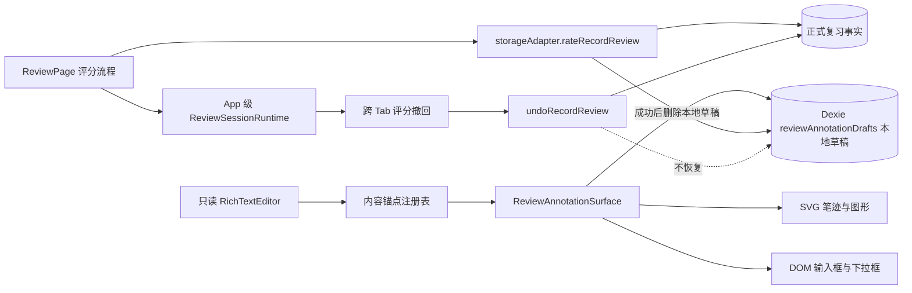
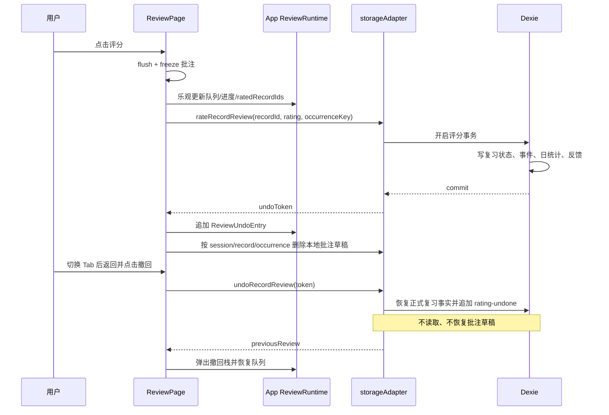

# 间隔复习批注画布、跨 Tab 评分撤回与顶部空间优化整体方案

## 1. 文档状态

- 状态：已复审并完成第一阶段实施与工具栏 UX 修复（2026-09-08）
- 适用范围：间隔复习队列中的只读笔记卡片，以及 Today、Review、Journal、More 主导航页面的首屏信息密度
- 批注能力落地于 schema 20，其中 `reviewAnnotationDrafts` 仅保存在设备本地；项目当前数据库基线为 schema 21，后续仅增加三张同样 local-only 的语音复述表
- 目标平台：Web、Electron、Capacitor Android
- 不在本方案范围：笔记编辑模式批注、批注云同步、批注导出、评分后批注恢复

本方案同时处理三个需求：

1. 在间隔复习只读预览上增加 PDF/Excalidraw 风格的批注工具，以及输入框、下拉选择等交互组件。
2. 修复卡片评分后切换到其他 Tab，再返回复习页时评分撤回栈丢失的问题。
3. 收紧 Today、Review、复习正文、Journal 和 More 页面的顶部标题区，为首屏有效内容留出更多空间。

前两个需求共享同一个评分生命周期，但采用不同的数据边界；顶部空间优化是独立的 UI 阶段，不改变数据语义：

- 评分撤回栈是 APP 进程级临时状态，APP 未退出时跨 Tab 保留，APP 重启后不承诺保留。
- 未评分批注是设备本地独立草稿，页面卸载、切换 Tab、刷新和 APP 重启后都可恢复；它不进入正文、备份、云同步或导出。评分成功后删除，撤回评分不恢复。
- UI 密度调整只修改布局结构和 CSS，不删除业务字段，不降低触控热区，不改变路由和复习流程。

## 1.1 审核结论与本次修正

这份方案的主要方向可采纳：只读正文上层绘制、结构化锚点、HTML 交互控件、App 级评分撤回、复习进行态紧凑 chrome、页面级密度调整，以及云同步/备份排除批注，均与当前产品边界一致。

需要修正或收窄的内容：

1. **批注使用独立本地持久化。** 新增 schema 20 的 `reviewAnnotationDrafts` 表，但不加入 `StorageSnapshot`、云同步、导出和记录转移；这满足正文不被修改以及页面/进程重启后可恢复。
2. **评分清除不宣称跨存储原子事务。** 评分正式事实由现有 Dexie 事务原子提交；批注在评分成功确认后删除。评分失败时批注保持不变；若删除失败，保留 `pendingClear` 并重试，不能把它描述成单一跨内存和 Dexie 的事务。
3. **撤回栈应提升到 App 级，但不把整个 ReviewPage 的所有局部状态都全局化。** 队列、模式和筛选继续由 `tabMemory.review` 管理；仅提升撤回 token、已评分集合、批注草稿和必要的会话状态。
4. **锚点允许有意省略，但禁止意外裁切。** 长标题、摘要和标签可使用明确的省略与完整查看方式；正文、输入内容和错误提示不得被无提示截断。
5. **精确布局 y 值只能作为回归目标，不能作为硬业务契约。** 字体加载、系统字号、动态工具栏和真实内容会改变高度，验收应以相对改善、无重叠和可操作性为主。
6. **当前方案的第三方库建议需保持可选。** `perfect-freehand` 不是第一阶段必需依赖；先用抽稀后的 Pointer Events 点列和 SVG 渲染验证性能，只有平滑笔迹质量确有需要时再单独评估。
7. **App 级运行时只承载评分撤回控制，不承载批注正文。** 批注草稿、flush 状态和待清除标记归 repository；否则无法兑现独立存储、异步重试和恢复语义。

## 1.2 实施记录

本次已落地 schema 20、本地批注 repository、正文块指纹与归一化坐标锚定、SVG 笔迹/基础图形、DOM 文本输入与下拉组件、颜色/线宽/透明度、批注撤回重做、评分后清除、App 级跨 Tab 评分撤回，以及五个目标页面的紧凑布局。复习进行态使用内联的 `review-session-chrome`，锚点测量内聚在 `ReviewAnnotationSurface`；工具栏固定在视口内，根据可见评分区动态调整底部位置，入口和互斥工具均公开明确的选中状态。

当前交付是可用的第一阶段，不等同于完整 Excalidraw 编辑器。元素选择后移动/缩放、框选与分组、复制、层级调整、跨块笔迹裁分、孤立锚点修复、触控笔专用模式和完整快捷键仲裁仍属于后续完善范围。语音阶段 0–6、2026-09-09 编辑器布局收口与真实 Provider 接入后，当前自动化基线为 Vitest `140` 个文件 / `889` 项测试（含 2 项需密钥的线上验收，未提供时跳过）、Desktop/Android-narrow Playwright `44/44`、Firebase Emulator `4/4`；Android 真机手写、中文 IME 和安全区仍保留人工验收门槛。

## 2. 现有实现分析

### 2.1 复习页面与只读正文

`src/pages/ReviewPage.tsx` 在复习队列模式下渲染 `RichTextEditor`，传入 `readOnly`、当前记录 ID、引用记录和引用打开回调。正文仍来自 `normalizeRecordContent(currentRecord)`，没有额外副本。

`src/components/RichTextEditor.tsx` 使用 Tiptap/ProseMirror：

- `editable: !readOnly` 控制正文可编辑性。
- 正文根节点 class 为 `rich-editor`。
- `EditorContent` 是最终 DOM 挂载点。

因此批注层应包装只读 `RichTextEditor`，不能把批注节点写进 ProseMirror 文档，也不能修改 `RecordBlock.contentHtml`。

### 2.2 页面卸载与状态丢失

`src/App.tsx` 只渲染当前 Tab，并通过 `PageTransition` 和 `pageKey` 管理页面切换。离开复习 Tab 后，`ReviewPage` 会卸载。

以下状态目前都定义在 `ReviewPage` 内部：

- `ratedRecordIds`
- `undoHistory`
- `pendingUndoRestore`
- `showAllDue`
- `dailyLimitIds`
- `blockFeedbackDrafts`

评分成功后，`ReviewUndoEntry` 被写入组件局部 `undoHistory`。一旦切换 Tab，组件卸载并销毁该数组；返回时 `undoHistory` 重新初始化为空，所以撤回按钮永久失效。这是本次 bug 的直接根因。

### 2.3 不应把撤回栈放入 TabMemory

`src/lib/tabNavigation.ts` 中的 `TabMemory.review` 已保存复习模式、队列、当前记录、进度和卡片库筛选状态。该对象还会通过 `src/lib/webNavigationHistory.ts` 序列化到浏览器 `history.state`。

评分撤回令牌不应加入 `TabMemory`，原因如下：

- 产品要求只保证 APP 未退出时可撤回，不要求刷新或重启后恢复。
- `RecordReviewUndoToken` 是针对某次最新评分事务的运行时能力，长期序列化后容易过期。
- 浏览器历史回退可能恢复旧快照，不能让旧历史页面覆盖当前撤回栈。
- 后续批注数据体积更大，更不能进入导航快照。

正确边界是在 `App` 根组件增加独立的 `ReviewSessionRuntimeState`。它跨 Tab 存活，但不进入 `TabMemory`、`history.state`、Dexie、备份或云同步。

### 2.4 评分与撤回事务

`src/pages/ReviewPage.tsx` 的 `rate` 当前先乐观更新队列和进度，再调用 `onRate`；成功时把返回的 `RecordReviewUndoToken` 放入撤回栈，失败时恢复队列和草稿。

`src/services/storageAdapter.ts` 的 `rateRecordReview` 在 Dexie 事务中写入复习状态、评分事件、日统计和决策块反馈。`undoRecordReview` 会校验待撤回事件仍是该记录最新的有效评分，然后恢复先前复习状态并追加 `rating-undone` 事件。

批注清除不加入评分事务；批注不能加入 `RecordReviewUndoToken`，也不能加入 `undoRecordReview` 的恢复事务。评分正式事实提交成功后，由批注 repository 删除对应 occurrence 的本地草稿。

### 2.5 顶部空间实机浏览器审计

审计于 2026-09-08 使用本地 `?preview=stage3` 数据完成，视口与项目 Playwright 基线一致：Desktop `1440 x 1000`、Android-narrow `390 x 844`。测量对象是浏览器实际布局后的 `getBoundingClientRect()` 和 computed style，不是只读 CSS 后的估算。

| 页面 | Desktop 实测 | Android-narrow 实测 | 判断 |
| --- | --- | --- | --- |
| Today | 页面顶边距 36px；Header 高 94px；首个创建区从 y=158 开始 | 页面顶边距 24px；Header 高 130px；创建区从 y=185 开始 | 移动端标题、标语和三项操作换行后过高；Header 下方仍有 24px 空白 |
| Review 总览 | 页面顶边距 36px；Header 高 66px；三级 Tab 到 y=165 | 页面顶边距 18px；Header 高 58px；三级 Tab 到 y=139 | 可压缩顶边距、Header 下间距和 Tab 高度，但需保留统计信息 |
| 复习正文 | `review-session` 从 y=175 开始；记录卡从 y=316 开始；正文从 y=523 开始 | session 从 y=149；记录卡从 y=253；正文从 y=435 | 最严重；总览 Header、三级 Tab、返回按钮、进度区和记录卡 34-40px 顶内边距发生叠加 |
| Journal | 页面顶边距 36px；Header 高 94px；视图 Tab 从 y=154 开始 | 页面顶边距 24px；Header 高 131px；视图 Tab 从 y=179 开始 | 窄屏“全局搜索”被挤到独占一行，标题与实际筛选区距离过大 |
| More | 页面顶边距 36px；Header 高 94px；首个 Section 从 y=160 开始 | 页面顶边距 24px；Header 高 111px；首个 Section 从 y=165 开始 | Subtitle 换行加上 section `margin-top: 30px`，重复制造垂直空白 |

截图核对还显示：

- 页面内容宽度合理，问题集中在纵向节奏，不需要收窄正文列宽。
- 主导航触控区和评分按钮高度不是浪费空间的主因，不应缩到 44px 以下。
- `visual-v2.css` 中 `.page { padding-top: 36px; }` 覆盖了 `layout.css` 的 30px；移动端又由通用 `.page` 和 Review 专属规则分别覆盖，当前密度缺少统一语义。
- `PageHeader density="compact"` 目前主要缩小标题字号，没有同步收紧 subtitle、margin 和移动端 actions 布局，所以 Today/More 即使使用 compact 仍然偏高。
- 复习进行态已经隐藏侧栏/底部导航，但仍渲染 Review 总览 Header 与三级 Tab；这是最大且最应优先消除的重复导航层。

## 3. 总体架构



核心原则：

1. `RecordBlock.contentHtml` 始终是唯一正文来源。
2. 批注是尚未完成评分的本地临时草稿，不是正式学习事实。
3. 评分撤回栈和批注草稿分离，禁止相互快照。
4. 评分事实成功提交后必须清除批注；评分失败不得清除。批注表与复习事实不做跨存储原子事务：评分事务先提交，随后执行带 occurrence 校验的删除，失败时以 `pendingClear` 重试。
5. 页面状态、设备本地状态和正式同步事实分别进入正确的所有权层。
6. 主导航页面采用同一套 compact Header 节奏，复习进行态使用独立的沉浸式紧凑控制带。
7. 空白压缩不能降低可访问性：交互热区至少 44 x 44px，文字不截断，系统安全区继续保留。

## 4. 跨 Tab 评分撤回 bug 修复

### 4.1 新增 APP 级运行时状态

新增 `src/features/reviewSession/runtime.ts`：

```ts
export interface ReviewUndoEntry {
  token: RecordReviewUndoToken;
  queueIds: string[];
  currentRecordId: string;
  blockFeedbackDrafts: Record<string, DecisionBlockFeedbackDraft>;
  dailyLimitIds: string[];
  showAllDue: boolean;
  reviewProgress: ReviewSessionProgress;
}

export interface ReviewSessionRuntimeState {
  day: ISODate;
  ratedRecordIds: string[];
  undoHistory: ReviewUndoEntry[];
}

export const createReviewSessionRuntime = (
  day = todayISO(),
): ReviewSessionRuntimeState => ({
  day,
  ratedRecordIds: [],
  undoHistory: [],
});
```

`dailyLimitIds`、`showAllDue`、反馈草稿和评分前进度已经包含在每条 `ReviewUndoEntry` 内，用于精确恢复被撤回卡片；不需要把这些值全部提升为全局常驻状态。

### 4.2 App 负责运行时所有权

在 `src/App.tsx` 中新增：

```ts
const [reviewRuntime, setReviewRuntime] = useState(
  () => createReviewSessionRuntime(),
);
```

向 `ReviewPage` 传入：

```ts
reviewRuntime={reviewRuntime}
onReviewRuntimeChange={setReviewRuntime}
```

该状态具备以下特征：

- 切换任意导航 Tab 后仍存在。
- 浏览器 history 前进/后退不会覆盖它。
- APP 根组件退出或页面完整刷新后自然清空。
- 不触发数据库、自动备份或云同步。

### 4.3 ReviewPage 改为受控撤回栈

从 `ReviewPage` 删除局部 `ratedRecordIds` 和 `undoHistory`，改为读取 `reviewRuntime`。

评分成功时：

1. 乐观把 `ratedId` 加入 `reviewRuntime.ratedRecordIds`。
2. 由 App 持有的评分控制器调用 `onRate`，不依赖可能已卸载的 `ReviewPage` 完成收尾。
3. 收到有效 token 后，通过 App 的函数式 state 更新把完整 `ReviewUndoEntry` 追加到 `reviewRuntime.undoHistory`。
4. 如果评分失败，从 `ratedRecordIds` 移除该 ID，并恢复原队列、当前记录、进度和反馈草稿。

撤回时：

1. 始终读取 `reviewRuntime.undoHistory` 的最后一项。
2. 调用现有 `onUndo(entry.token)`。
3. 成功后弹出最后一项、移除 `ratedRecordIds` 中的记录 ID。
4. 恢复评分前队列、当前卡片、复习进度、每日范围和决策块反馈草稿。
5. 批注保持为空，不从 `ReviewUndoEntry` 恢复。

### 4.4 日期和失效处理

- 当 `todayISO()` 与 `reviewRuntime.day` 不同，清空撤回栈并建立新日会话。
- 如果 `undoRecordReview` 因为同步、重复操作或更新评分而返回 `undefined`，必须把它视为“撤回未执行”，不能静默从本地栈弹出。
- 建议把 `ReviewPageProps.onUndo` 从 `Promise<void>` 改为 `Promise<RecordReviewState | undefined>`，由页面根据返回值决定是否消费撤回条目。
- 所有显示错误继续通过 `formatUiError`，不得渲染原始 `error.message`。
- 保持 LIFO 语义；跨多张卡片和跨多次 Tab 切换仍可逐次撤回，直到栈为空或某一条令牌失效。

### 4.5 并发导航

评分请求进行中切换 Tab 时，异步回调仍应更新 `App` 持有的运行时状态。返回复习页后：

- 请求成功：撤回按钮可用。
- 请求失败：队列和进度已恢复，错误在运行时状态中保留到下次进入复习页。

为此建议把评分 promise、`ratingRecordId`、`undoing` 和格式化后的 `ratingError` 交给 App 级 session controller 管理；页面卸载后不得依赖局部 `setState` 完成关键收尾。它们仍然只存在于 APP 进程，不进入导航历史。这样可以避免页面卸载期间的请求结果丢失和 React 卸载更新警告。

## 5. 批注领域模型

### 5.1 本地批注草稿

在 `src/types.ts` 或独立领域文件中定义：

```ts
export interface ReviewAnnotationDraft {
  id: EntityId; // 与 recordId 相同，每个记录最多一个活动草稿
  recordId: EntityId;
  reviewOccurrenceKey: string;
  contentRevision: string;
  schemaVersion: 1;
  elements: ReviewAnnotationElement[];
  history: ReviewAnnotationCommand[];
  historyCursor: number;
  pendingClear?: boolean;
}
```

`reviewOccurrenceKey` 应由以下稳定字段生成：

```text
recordId | lastReviewedAt-or-never | nextReviewDate-or-none | totalReviews
```

不要直接使用 `RecordReviewState.updatedAt`，因为同步或非评分状态维护可能只改变时间戳，从而错误地让草稿失效。

`contentRevision` 使用规范化 `contentHtml` 的 SHA-256。项目已依赖 `@noble/hashes`，无需引入另一套哈希实现。

### 5.2 元素类型

```ts
type ReviewAnnotationElement =
  | FreehandElement
  | HighlightElement
  | LineElement
  | ArrowElement
  | RectangleElement
  | EllipseElement
  | DiamondElement
  | TextElement
  | InputElement
  | SelectElement;
```

公共字段包括：

- `id`、`groupId`、`kind`
- `anchor`
- `frame`
- `rotation`
- `zIndex`
- `style`
- `createdAt`、`updatedAt`

交互组件附加字段：

- 输入框：`value`、`placeholder`、`multiline`、`maxLength`
- 下拉框：`options`、`selectedOptionId`、`placeholder`

限制建议：每卡最多 500 个元素、单元素最多 4,096 个原始点、输入内容最多 2,000 字符、下拉选项最多 50 项、单草稿序列化后最多 2 MiB。达到限制时给出经过 `formatUiError` 处理的用户提示。

## 6. 内容锚定与重排

### 6.1 AnchorRegistry

新增 `src/features/reviewAnnotations/anchorRegistry.ts`，通过受控回调取得 `editor.view`，遍历 ProseMirror 文档，为可见块建立注册表：

```ts
interface ReviewContentAnchor {
  path: number[];
  nodeType: string;
  fingerprint: string;
  textQuote?: {
    exact: string;
    prefix: string;
    suffix: string;
  };
}
```

这些锚点只存在于批注数据和渲染 DOM 属性中，不通过 Tiptap transaction 写回正文。

### 6.2 几何坐标

- 画布容器与 `.rich-editor` 使用同一定位上下文。
- 元素位置保存为锚点块内归一化坐标，尺寸保留创建时基准宽高。
- 跨多个正文块的自由笔迹在提交时裁分为多个片段，共享同一 `groupId`。
- 选择、删除和撤回以 group 为单位，用户不会感知内部裁分。
- 页面滚动时不写状态，只依靠共同 DOM 容器同步移动。

### 6.3 布局更新

下列事件触发重新测量：

- `ResizeObserver` 观察正文根节点和已注册块。
- 窗口 resize、方向变化、视觉视口变化。
- 图片加载、折叠块展开、结构图和 Mermaid 完成布局。
- 字体加载完成。

多个事件必须合并到单个 `requestAnimationFrame`，避免滚动和输入期间反复同步布局。

### 6.4 正文发生修改

解析顺序：

1. 精确结构路径和节点类型。
2. 同级节点内容指纹。
3. 邻近路径中的 `textQuote` 上下文。
4. 无法唯一匹配则标记 orphan。

orphan 元素默认隐藏，并在工具栏显示“失效批注”计数，允许用户查看列表并删除。禁止自动吸附到模糊匹配的其他段落。

## 7. 工具栏与交互

### 7.1 工具集合

- 导航：手型、选择、框选
- 笔迹：画笔、荧光笔、橡皮
- 图形：直线、箭头、矩形、圆、菱形
- 内容：文本、单行/多行输入框、下拉选择
- 样式：颜色色板、线宽、透明度、实线/虚线
- 编辑：复制、置顶、置底、删除、清空本卡
- 历史：批注撤回、批注重做

图标使用现有 `lucide-react`，颜色必须使用色板控件，线宽和透明度使用滑块。陌生图标必须提供 tooltip 和 `aria-label`。

### 7.2 响应式布局

- 桌面：正文侧边或正文顶部的紧凑浮动工具栏。
- Android 窄屏：底部横向滚动工具栏，位于评分栏上方并考虑 `safe-area-inset-bottom`。
- 工具栏关闭时批注继续显示；非交互图形不截获正文点击。
- 输入框和下拉框使用真实 DOM 控件，支持中文 IME、键盘 Tab、屏幕阅读器和表单焦点。

### 7.3 指针仲裁

- 默认手型模式允许正文滚动、文本选择、引用链接和图片操作。
- 选择绘制工具后才对绘图区域使用 `touch-action: none`。
- 使用 Pointer Events 和 `setPointerCapture` 统一鼠标、触控笔和触屏。
- `pointercancel` 必须结束或取消当前手势，不能留下半条笔迹。
- 移动端应提供“仅触控笔绘制 / 手指也可绘制”开关，默认允许手型滚动。

### 7.4 撤回快捷键优先级

`Ctrl/Cmd+Z` 按以下顺序处理：

1. 输入框、文本组件聚焦：浏览器原生文本撤回。
2. 批注工具栏已打开且批注历史非空：批注撤回。
3. 批注工具栏关闭或批注历史为空：评分撤回。

批注撤回栈保存在批注草稿中；评分撤回栈保存在 `ReviewSessionRuntimeState` 中，两者不得共用数组。

## 8. 存储与事务

### 8.1 Dexie 本地表

schema 20 新增 `reviewAnnotationDrafts`，每个 `(recordId, reviewOccurrenceKey)` 最多一条活动草稿。建议索引为 `id` 主键、`recordId`、`[recordId+reviewOccurrenceKey]`，并保存 `contentRevision`、元素/命令历史、`pendingClear` 和更新时间。该表属于设备本地临时数据，不进入 `StorageSnapshot`、云同步、备份、导出或记录转移。

迁移必须保持可重试且不改写既有复习事实；旧数据库升级后批注表为空。删除记录、完整备份恢复和显式结束复习会话时，按 `recordId` 清理对应草稿。

### 8.2 批注 Repository API

新增 `src/features/reviewAnnotations/repository.ts`，封装 Dexie 访问并集中做 schema/大小校验：

```ts
getDraft(recordId, reviewOccurrenceKey): Promise<ReviewAnnotationDraft | undefined>
upsertDraft(draft): Promise<void>
markPendingClear(recordId, reviewOccurrenceKey): Promise<void>
deleteDraft(recordId, reviewOccurrenceKey): Promise<void>
deleteRecordDrafts(recordId): Promise<void>
retryPendingClears(): Promise<void>
```

保存前校验 `reviewOccurrenceKey`、`contentRevision` 和元素上限；写入采用 debounce、`pointerup` 或显式 flush。Repository 不调用 cloud mutation，也不把批注映射到任何同步实体。

### 8.3 写入节流

- 绘制时只更新渲染状态，不逐点写库。
- `pointerup` 后先抽稀和量化，再提交一次操作。
- 文本输入以 250 ms debounce 更新本地草稿，并在 blur、Tab 切换和评分前 flush；评分进行中禁止旧 occurrence 的迟到写入。
- 每条笔迹是一个历史命令，不为每个点创建历史记录。
- 历史最多 100 条命令；超过上限时压缩为当前元素快照。

可在性能验证后单独评估 `perfect-freehand` 生成平滑笔迹 SVG path；首轮直线和预设图形直接使用 SVG，不引入完整 Excalidraw/tldraw 运行时，也不把该依赖列为当前阶段前置条件。

## 9. 评分、批注清除与跨 Tab 撤回的联合流程



评分成功后的批注清除必须同时匹配：

- `recordId`
- 调用评分时捕获的 `reviewOccurrenceKey`

清除发生在 `onRate` 成功返回之后，不宣称与复习事实跨存储原子提交。评分开始时先 freeze 草稿；成功后删除，失败后写入 `pendingClear` 并重试，避免迟到的 debounce 重新写回已评分 occurrence。评分失败则解冻并保留草稿。

异常语义：

- flush 失败：不允许发起评分，保留当前卡片和批注。
- 评分事务失败：批注不删除，恢复乐观 UI。
- 评分成功但页面已切换：结果仍写入 App 级撤回栈。
- 撤回失败或 token 失效：保留撤回条目并显示错误，不能假装成功。
- 撤回成功：卡片恢复，批注为空；允许用户创建新的批注草稿。

## 10. 备份、云同步与删除边界

批注草稿是设备本地 Dexie 数据，不是正式复习事实：

- 不加入 `BackupPayload`。
- 不加入 `CloudSyncEntityType`。
- 不加入 ZIP、流式备份、原生 repository、知识导出或记录转移。
- 不调用 `markCloudSyncMutation`，单纯批注操作不应触发云同步或自动备份。
- 普通云同步恢复后，不触碰当前会话批注；当前记录内容变化时按指纹重新判定 anchor，无法匹配则标记 stale/orphan。
- 完整备份恢复、永久删除记录或结束复习会话时删除相关本地草稿。
- 软删除记录时隐藏草稿；恢复记录且 occurrence key 有效时可继续使用。

评分操作本身仍按现有逻辑标记云同步 mutation；批注操作不触发云同步或自动备份。

## 11. 顶部空间优化设计

### 11.1 共用密度规则

扩展 `PageHeader` 的 density 语义，而不是在五个页面分别堆叠无关覆盖：

- `normal`：保留给设置、备份、详情等非主导航页面，避免无意改变全站。
- `compact`：主导航默认密度，同时控制标题字号、内部行距、subtitle margin、Header margin 和 actions 排列。
- `immersive`：仅用于复习进行态；实际上由专用 `ReviewSessionChrome` 取代完整 `PageHeader`。

为 Today、Review、Journal、More 添加共同的 `primary-workspace-page` class，CSS 变量集中定义：

```css
.primary-workspace-page {
  --workspace-top-space: 24px;
  --workspace-header-gap: 12px;
  --workspace-section-gap: 14px;
}
```

Android-narrow 下建议变为 `16px / 8px / 10px`。实现时用页面级 class 限定，不直接把所有 `.page` 从 36px 全局压缩，以免影响编辑器、设置、备份、播客和 AI 页面。

文字字号只做小幅调整，不按 viewport 宽度连续缩放：主导航 H1 桌面约 28px、移动端约 23px；eyebrow 12px；subtitle 14px，行高约 1.45。核心节省来自布局间距和重复区域，不来自把文字缩到难读。

### 11.2 Today 页面

目标：Android-narrow 的 `.today-compose-band` 顶部从当前约 y=185 提前到 y=145-155；Desktop 从 y=158 提前到 y=125-135。

修改：

- `.today-page` 顶边距：Desktop 36px -> 24px；移动端 24px -> 16px。
- compact Header 的标题、日期和标语内部间距压缩约 6-8px。
- Header 到创建区的 margin：24px -> 12px（移动端 10px）。
- 保留“距离目标”、云同步和收藏三项，但移动端让它们与标题块形成紧凑的第二行，不增加额外上下 margin。
- `.today-goal-pill` 和两个 icon button 保持至少 36px 可见尺寸、44px 点击热区；通过伪元素或父容器热区扩展实现，不压缩可点性。
- `.today-compose-band` 高度 70px 暂不缩小，因为它是主要动作；其下 margin 28px -> 18px，使复习提醒更早出现。

### 11.3 Review 总览

目标：Android-narrow 的 `.review-mode-tabs` 底部从 y=139 提前到 y=108-116；Desktop 从 y=165 提前到 y=126-136。

修改：

- `.review-page` 顶边距：Desktop 36px -> 24px；移动端 18px -> 12px。
- `.review-page-header` margin-bottom：18px -> 8px。
- 到期和过期统计继续显示在标题下方，行高压到 1.35，禁止删字段。
- `.review-mode-tabs` 可视高度从 45px 收到 40px，但每个按钮通过横向和透明点击区保持 44px 触控目标。
- Tab 下方 margin 10px -> 6px；卡片库 summary 上下 padding 各减少 2-4px。
- 工具菜单按钮维持 44px 点击区，图标容器可保持 36px。

### 11.4 复习正文沉浸态

目标：Android-narrow 的记录标题顶部进入 y=90-120、正文进入 y=230-280；Desktop 的记录标题进入 y=105-140、正文进入 y=250-320。实际位置会受标题、标签和决策块数量影响，因此验收以“相对当前至少提前 120px”及无重叠为双重条件。

结构调整：

1. 当 `mode === "queue" && currentRecord` 时，不渲染总览用的 `PageHeader` 和 `review-mode-tabs`。它们在沉浸态属于重复导航。
2. 新增 `ReviewSessionChrome`，在一行内承载返回按钮、`第 n / total 条`、到期状态和进度线。
3. Desktop 可使用左侧返回、中间细进度线、右侧计数；移动端使用第一行返回/计数/状态，第二行 3px 进度线，总高控制在 48-56px。
4. `review-session-exit` 不再单独占 40px 高的一整行；按钮仍有 44px 点击区。
5. `review-session-progress` 不再保留当前 63px Desktop 独立区域。
6. `.review-record-card` 顶内边距由当前 34-40px 降为 Desktop 16px、移动端 12px。
7. 评分栏仍保持 sticky 和 44px 以上按钮高度；未来批注工具栏放在正文工具入口中，不重新堆叠一个永久大标题区。

该结构会同时改善批注体验：更大的正文可视区意味着触控绘图时更少被顶部 chrome 挤压，锚点测量也不必处理无意义的大空白。

### 11.5 Journal 页面

目标：Android-narrow 的 `.journal-view-tabs` 顶部从 y=179 提前到 y=125-140；Desktop 从 y=154 提前到 y=120-130。

修改：

- 为 Journal 使用 compact Header；Desktop/移动端顶边距分别为 24px/16px。
- Header margin-bottom 从 24px 改为 12px/10px。
- 移动端把全局搜索显示为 Search 图标按钮，与标题同行，使用 tooltip 和 `aria-label`；桌面保留“全局搜索”文字。
- Subtitle 保留，但移动端单行显示；空间不足时正常换行，不能与搜索按钮重叠。
- `.journal-view-tabs` 高度从 43px 调到 40px，触控热区保持 44px。
- 学科条和结果统计随后各收紧 2-4px，不能压缩日志卡片正文。

### 11.6 More 页面

目标：Android-narrow 的第一个“工具”标题从约 y=169 提前到 y=105-120；Desktop 从 y=164 提前到 y=120-130。

修改：

- `.more-page` 顶边距使用 24px/16px。
- compact Header margin-bottom 由 24px 降到 8-10px。
- 保留 `More` eyebrow、“更多”和说明；移动端 subtitle 行高从 1.65 收到约 1.45。
- `.more-section:first-of-type` 的 margin-top 从 30px 降到 10px；后续 section 的 30px 分组间距可降到 22px，但仍需清楚区分“工具 / 应用 / 系统”。
- ListRow 的 70px 最小高度不是顶部浪费来源，首轮不压缩；避免信息拥挤和触控退化。

### 11.7 CSS 所有权与回归防护

涉及文件：

- `src/components/ui.tsx`：完善 `PageHeader` density，不塞页面特例。
- `src/pages/TodayPage.tsx`、`ReviewPage.tsx`、`JournalPage.tsx`、`MorePage.tsx`：增加明确的页面 class/density；复习进行态条件渲染紧凑 chrome。
- `src/styles/layout.css`：只保留通用页面和 Header 基线。
- `src/styles/pages.css`：页面结构、复习沉浸态和响应式布局。
- `src/styles/visual-v2.css`：reading/modern 视觉覆盖，不重复定义尺寸来源。

需要清理同一选择器在 `layout.css`、`pages.css` 和 `visual-v2.css` 中互相覆盖的尺寸声明。每个关键尺寸只保留一个主要所有者，主题层只处理字体、颜色、边框和必要的视觉差异。

新增 Playwright 几何断言时避免只依赖截图：

- 测量 Header、首个有效区域和复习正文的 bounding box。
- Desktop 与 Android-narrow 分别设置宽松但有意义的最大 y 值。
- 验证所有可见主要按钮的可点击边界至少为 44 x 44px，或拥有等效的透明命中区域。
- 验证标题、subtitle、actions、Tab、复习进度和批注工具栏不重叠。
- 截图作为视觉回归证据，几何断言作为稳定失败信号。

## 12. 文件级实施清单

### 12.1 新增文件

- `src/features/reviewSession/runtime.ts`
- `src/features/reviewAnnotations/domain.ts`
- `src/features/reviewAnnotations/repository.ts`
- `src/features/reviewAnnotations/ReviewAnnotationSurface.tsx`

锚点测量与校验分别内聚在 `ReviewAnnotationSurface.tsx` 和 `repository.ts`。当后续出现第二个画布消费者或逻辑继续增长时，再提取 `anchorRegistry.ts`/`validation.ts`；当前不创建无复用价值的转发层。

### 12.2 修改文件

- `package.json`：首轮不增加画布运行时依赖；平滑笔迹库另行评估。
- `src/types.ts`：新增批注领域类型；StorageAdapter 仅提供数据库表初始化/迁移所需的内部访问，不把批注暴露为同步事实。
- `src/components/RichTextEditor.tsx`：以受控回调暴露只读 editor view/root。
- `src/pages/ReviewPage.tsx`：集成画布、使用受控 ReviewSessionRuntime、调整快捷键。
- `src/pages/ReviewPage.test.tsx`：批注和跨 Tab 撤回组件行为。
- `src/App.tsx`：持有 APP 进程级复习运行时状态。
- `src/components/ui.tsx`：完善 compact Header 密度语义。
- `src/pages/TodayPage.tsx`、`JournalPage.tsx`、`MorePage.tsx`：接入主导航紧凑布局。
- `src/services/storageAdapter.ts`：schema 20 建表与记录删除清理；保持现有评分和撤回事务，不把批注并入评分事务。
- `src/services/storageAdapter.review.test.ts`：验证评分正式事实与会话批注清除的边界。
- `src/styles/layout.css`：通用页面和 PageHeader 基线，移除与页面层重复的尺寸覆盖。
- `src/styles/pages.css`：画布、紧凑顶部、沉浸式复习 chrome、工具栏和 Android 窄屏样式。
- `src/styles/visual-v2.css`：reading/modern 主题适配，主题层不再重复控制通用尺寸。
- Playwright 复习验收文件：增加桌面与 Android-narrow 场景。

## 13. 实施阶段

### 阶段 1：先修复跨 Tab 撤回

1. 提取 `ReviewUndoEntry` 和 `ReviewSessionRuntimeState`。
2. 在 `App` 持有运行时状态。
3. 改造 `ReviewPage` 为受控撤回栈。
4. 增加跨 Tab、跨多卡和日期切换测试。

退出条件：评分后任意切换 Tab，多次返回复习页仍能按 LIFO 撤回；APP 完整重载后栈清空。

### 阶段 2：主导航顶部空间优化

1. 建立 Desktop 与 Android-narrow 几何基线测试。
2. 统一主导航 compact Header 密度和页面顶边距。
3. 分别优化 Today、Review 总览、Journal 和 More 的首屏节奏。
4. 将复习进行态改为 `ReviewSessionChrome`，移除重复总览 Header/Tab。
5. 复测触控热区、文本换行、安全区和两种 visual theme。

退出条件：五个目标界面的首个有效内容达到 11.2-11.6 的目标范围，复习正文相对当前至少提前 120px，且没有重叠或触控面积退化。

### 阶段 3：会话批注状态与生命周期

1. 增加 schema 20 本地批注表、repository、occurrence key、content revision 和数据校验。
2. 实现评分前 freeze、评分成功后清除、评分失败后保留。
3. 验证页面/Tab 切换和刷新/进程重启后的本地草稿恢复，以及显式结束会话后的清理。
4. 验证评分失败和撤回不恢复批注。

退出条件：所有生命周期可在会话 store 与评分边界测试中确定性验证，数据库为 schema 20，且正式备份和云同步契约保持不变。

### 阶段 4：锚点与基础笔迹

1. RichTextEditor 暴露只读 editor view。
2. 实现 AnchorRegistry、块命中和 ResizeObserver。
3. 实现选择、画笔、荧光笔、橡皮和基础历史。

退出条件：滚动、窗口缩放、图片加载和窄屏重排后批注仍跟随原正文块。

### 阶段 5：图形和交互组件

1. 增加线、箭头、矩形、圆、菱形和文本。
2. 增加原生输入框、文本域和下拉选择。
3. 完成选择、移动、缩放、层级、样式和复制。

退出条件：桌面键鼠、Android 触控和中文 IME 均可用。

### 阶段 6：联合 UI 与竞态

1. 实现评分前 flush/freeze。
2. 阻止评分后的迟到写。
3. 明确批注撤回与评分撤回快捷键优先级。
4. 覆盖评分过程中切换 Tab、评分失败、撤回失败。

退出条件：所有评分、导航和批注竞态都有自动化测试。

### 阶段 7：全边界验收

1. 备份、流式恢复、云恢复、记录删除和记录转移测试。
2. Desktop 和 Android-narrow Playwright。
3. 构建与样式检查。

退出条件：通过本项目完整验证命令且无现有测试回归。

## 14. 自动化测试矩阵

### 14.1 评分撤回

- 评分一张卡，切到 Today，再返回 Review，撤回成功。
- 评分多张卡并多次切换 Tab，按逆序全部撤回。
- 切换浏览器 history 前进/后退，不覆盖 App 级撤回栈。
- APP 根组件重新挂载后撤回栈为空。
- 跨日期后旧撤回栈清空。
- token 已失效时不弹栈，显示格式化错误。
- 评分请求尚未结束时切换 Tab，成功结果仍进入撤回栈。
- 评分请求失败时切回 Review，卡片和进度已恢复。

### 14.2 批注生命周期

- 创建笔迹后切换 Tab，返回后笔迹存在。
- 创建输入框和下拉选择，切换页面后值存在。
- 关闭并重新打开工具栏，元素不丢失。
- 评分成功后本地草稿表中无对应记录。
- 评分失败后本地草稿仍存在。
- 评分成功后撤回，卡片恢复但批注为空。
- 撤回后新增批注，只创建新草稿，不关联已删除历史。
- 评分后的迟到 debounce 被 occurrence key 拒绝。

### 14.3 锚定与交互

- 页面滚动时批注与锚点块位移一致。
- 桌面宽屏切换到 Android 窄屏后，批注仍解析到相同块。
- 图片加载改变高度后，下方批注重新定位。
- 折叠块、结构图和 Mermaid 重排后批注不漂移。
- 正文外部编辑后可精确重连的批注继续显示。
- 无法唯一重连的批注成为 orphan，不显示到错误段落。
- 手型模式可滚动、选择文字、打开引用和图片。
- 绘图模式正确捕获指针并处理 `pointercancel`。
- 中文 IME 输入、退格、方向键和下拉键盘导航正常。

### 14.4 数据边界

- schema 20 迁移只新增批注表，不改写既有复习事实。
- ZIP、流式备份、云快照和记录转移均不包含批注。
- 普通批注保存不增加 cloud mutation epoch。
- 完整恢复清空批注。
- 云恢复保留仍匹配的本地草稿并隔离失效草稿。
- 永久删除记录清除草稿。

### 14.5 顶部空间与首屏信息密度

- Desktop 1440 x 1000 与 Android-narrow 390 x 844 都执行几何断言和截图。
- Today 的创建入口、Review 的模式 Tab、Journal 的浏览 Tab、More 的第一个 section 均在目标 y 范围内。
- 复习进行态不显示总览 Header 和三级 Tab，只显示紧凑 session chrome。
- 复习记录标题和正文相对旧基线至少提前 120px。
- 日期、标题、标语、到期/过期统计和 More subtitle 仍然存在。
- Journal 移动端搜索按钮拥有 `aria-label` 和 tooltip，桌面文字按钮仍存在。
- 标题、subtitle、actions 和 tabs 在 320px、390px、768px、1440px 宽度下无重叠。
- reading 与 modern 主题具有相同布局几何，字体差异不造成遮挡。
- 主要触控目标至少 44 x 44px 或具有等效命中区。
- 浏览器字号放大和项目 `fontScale` 上调后，文字正常换行且不遮挡首个内容区。

## 15. 手工验收脚本

1. 打开至少包含长正文、图片、结构块和引用链接的到期卡片。
2. 添加画笔、箭头、矩形、文本、输入框和下拉框。
3. 滚动正文并改变窗口宽度，确认每个元素跟随对应内容。
4. 切换到 Today、Journal、Categories 和 More，再返回 Review，确认批注和值仍存在。
5. 给当前卡片评分，确认进入下一卡且原批注消失。
6. 再次切换 Tab 并返回，点击评分撤回，确认原卡片恢复且撤回按钮有效。
7. 确认恢复后的卡片没有评分前的任何批注。
8. 在恢复卡片上新建批注，确认它属于新的未评分草稿。
9. 模拟评分存储失败，确认卡片、批注、反馈草稿和复习进度全部恢复。
10. 在 Android 实机验证手写、页面滚动、中文 IME、系统返回键和底部安全区。
11. 在 Desktop 和 Android 窄屏依次打开 Today、Review 总览、Review 正文、Journal、More，对照首屏确认顶部空间已收紧。
12. 开启最大应用字号并切换 reading/modern，确认 Header、操作按钮、Tab 和正文不重叠。
13. 在复习正文确认返回、进度、卡片序号和到期状态仍可见，但不再重复显示总览标题和三级 Tab。

## 16. 验证命令

```powershell
npm run test
npm run test:e2e
npm run test:firebase
npm run build
git diff --check
```

Firebase 测试预计不需要新增批注实体用例，因为批注明确不进入云同步；但必须运行现有套件证明 `CloudSyncEntityType`、写入预算和 no-op lock 行为没有回归。

## 17. 完成定义

只有同时满足以下条件，功能才算完成：

- 正文 `contentHtml` 在所有批注操作后字节级不变。
- 未评分批注在页面和 Tab 切换后完整保留。
- 批注随滚动和响应式重排稳定跟随内容。
- 评分正式事实提交成功后才清除会话批注；两者不宣称跨内存和 Dexie 的单一原子事务。
- 评分失败不会丢失批注。
- 评分成功后，无论是否切换 Tab、是否撤回评分，旧批注都不会恢复。
- APP 未退出时，评分撤回栈跨 Tab 保持可用并支持多步 LIFO 撤回。
- APP 重启后不恢复评分撤回栈。
- 批注不进入云同步、备份、知识导出或记录转移。
- Today、Review、复习正文、Journal、More 的首屏有效内容达到本方案目标位置。
- 复习进行态只保留一条紧凑 session chrome，正文相对旧基线至少提前 120px。
- 所有被压缩区域在 Desktop、Android-narrow、两种视觉主题和放大字号下无重叠。
- 主要触控目标没有因视觉压缩低于 44 x 44px。
- Desktop、Android-narrow 自动化验收通过，Android 实机输入和手势门槛完成。
